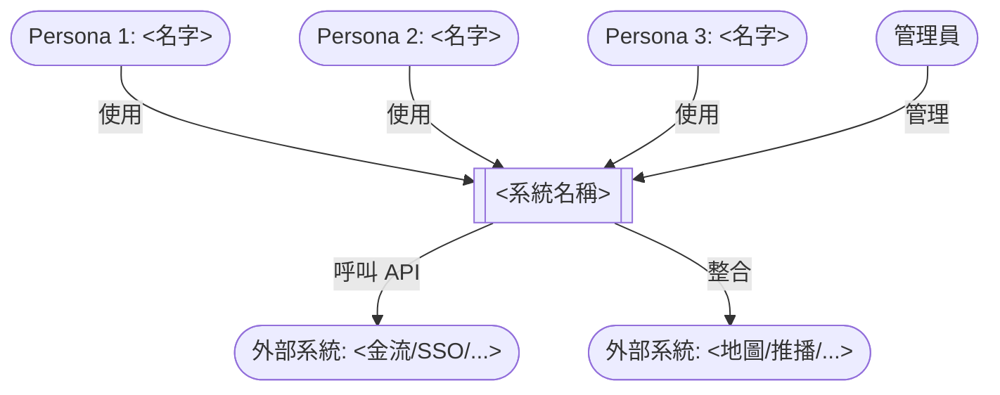
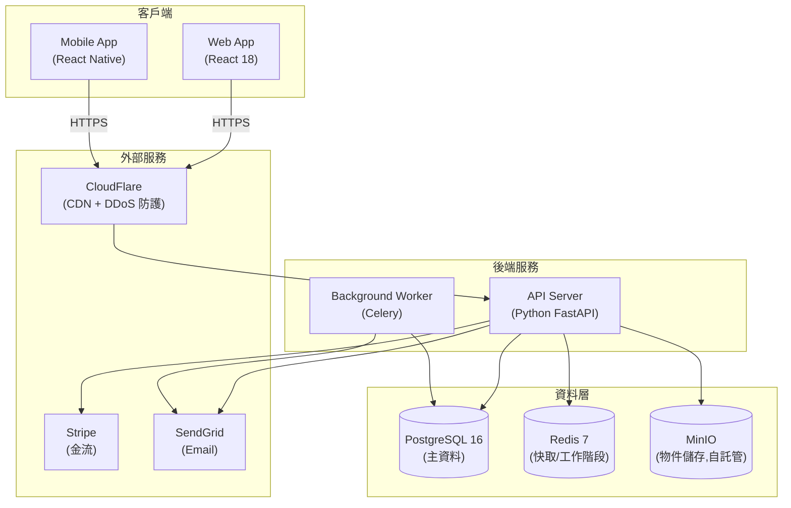
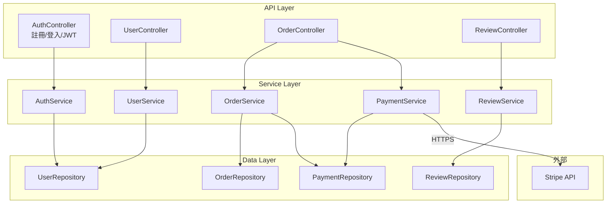
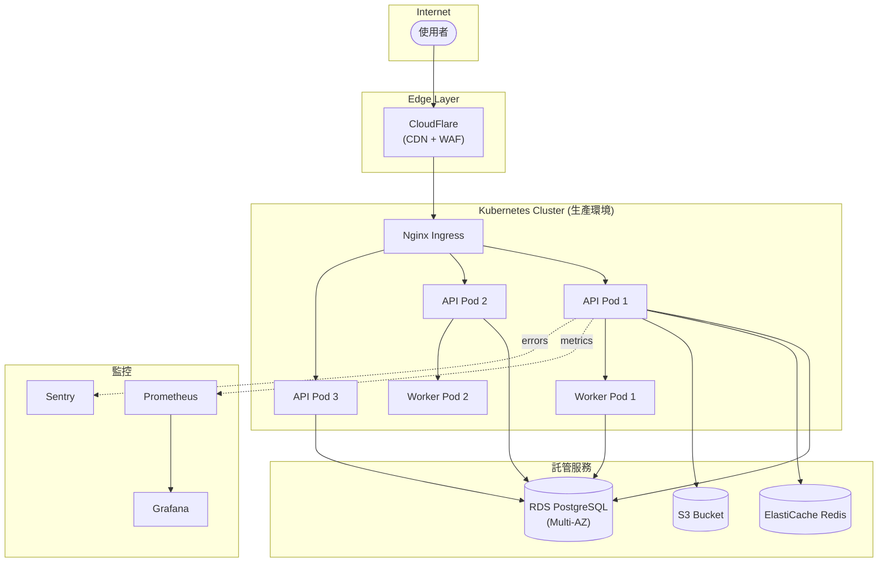

# [專案名稱] 系統架構文件(範本)

> **這是 system-architect 代理的交付物範本**。完整方法論見 `~/.hermes/profiles/system-architect/skills/system-architecture/SKILL.md`。
> 複製這個檔、把 `[...]` 佔位符替換成實際內容,完成後存到 `~/.hermes/handoff/<project-slug>/architecture.md`。
>
> **複雜度**:[S / M / L] — [一句話說明為什麼這個等級]

---

建立日期:YYYY-MM-DD
負責代理:system-architect
承接自:prd-<slug>.md + consumer-needs-research.md
接手代理:engineering-lead (未來建立)
專案階段:2 - 技術架構

---

## §1 系統脈絡圖(C4 Level 1)

回答「**誰在用這個系統、系統對外界的介面是什麼**」。

**目的**:讓所有讀者一眼看到「這系統給誰用、跟誰互動」。

---

## §2 容器圖(C4 Level 2)+ 技術選型

回答「**系統內部由哪些容器組成、各容器用什麼技術**」。

### 技術選型表(每個決策附「為何選 + 替代方案 + 何時要改」)

| 容器 | 選型 | 為何選 | 替代方案 | 何時要改 |
|------|------|-------|---------|---------|
| Web 前端 | React 18 | 團隊熟、社群大、SSR 支援(Next.js 14) | Vue 3(若團隊熟) | 需更輕量化時改 Svelte |
| Mobile | React Native | 跨平台節省成本、TS 生態系 | Flutter(若需要更高效能) | 需原生模組深度整合時改 Swift/Kotlin |
| API 後端 | Python FastAPI | async 支援、型別安全、自動 OpenAPI | Node.js(若 JS 團隊為主) | 需高併發時改 Go |
| Worker | Celery | Python 生態、可靠、支援排程 | BullMQ(若用 Node) | 需要 stream processing 時改 Kafka + Faust |
| 主資料庫 | PostgreSQL 16 | 開源、JSON 支援、MVCC、GIS 擴展 | MySQL(若需要 Oracle 商業支援) | 需要分散式時改 CockroachDB |
| 快取 | Redis 7 | 多用途、支援 pub/sub、streams | Memcached(純快取場景) | 需持久化 queue 時改 RabbitMQ |
| 物件儲存 | MinIO(自託管) | S3 相容、資料自主 | AWS S3(若上雲) | 規模 > 1TB/月時改 S3 |
| CDN | CloudFlare | 免費方案強、DDoS 防護內建 | CloudFront(若全部用 AWS) | 需 edge computing 時改 Cloudflare Workers |
| 金流 | Stripe | 國際通用、文件好、Webhook 完整 | 藍新 / TapPay(若主打台灣) | 需本地金流時加藍新 |

---

## §3 元件圖(C4 Level 3)

回答「**後端 API 服務內部由哪些元件組成、彼此怎麼呼叫**」。

**挑選原則**:只畫**核心 5-8 個元件**——認證、核心業務(每個 Must-have User Story 對應一個 service)、資料存取、外部整合閘道。

### 元件職責簡述

| 元件 | 職責 | 對應 User Story |
|------|------|----------------|
| AuthController / AuthService | 註冊、登入、密碼重設、Token 刷新 | US-001, US-002 |
| UserController / UserService | 個人資料、頭像、技能標籤 | US-003 |
| OrderController / OrderService | 建立訂單、查訂單、取消 | US-004 |
| ReviewController / ReviewService | 撰寫評價、查評價 | US-005 |
| PaymentService | 建立 PaymentIntent、處理 Webhook、對帳 | US-006 |

---

## §4 部署拓樸(只在 L 等級產出,本範本為示意)

---

## §5 [架構決策待釐清]

從 PRD 內所有 [待釐清] 標記升級而來。每個都標明:需要誰決定、需要什麼資訊、不決定的風險。

| # | 議題 | PRD 原始標記 | 需要的資訊 | 不決定的風險 | 決定者 |
|---|------|------------|-----------|------------|--------|
| 1 | <議題> | [待釐清] | <需要什麼> | <什麼後果> | <誰> |
| 2 | ... | ... | ... | ... | ... |

**原則**:**不裝懂**——有疑問就標出來,不要為了「看起來完整」而硬給答案。

---

## §6 給 engineering-lead 的「1 小時上手 checklist」

工程師看完這份 architecture.md 後,應該能:

- [ ] 在 1 小時內開始寫 code(終極驗收標準)
- [ ] 知道每個元件的職責跟呼叫關係
- [ ] 知道每張表的 schema 跟索引(看 `database-schema.md`)
- [ ] 知道每個 API 端點的請求/回應/錯誤碼(看 `api-spec.md`)
- [ ] 知道每個技術選型「為何選這個 + 何時要改」
- [ ] 知道哪些 [架構決策待釐清] 是 mock 先做、哪些是真的要問 PM

---

## §7 自我審查(交付前必跑)

- [ ] Mermaid 圖在 GitHub 預覽能正常渲染?
- [ ] 三大 Persona 的 User Story 都有對應元件?
- [ ] 每個技術選型都附「為何選 + 替代方案 + 何時要改」?
- [ ] [架構決策待釐清] 有主動標出、不裝懂?
- [ ] §6 checklist 完整、可執行?

---

**版本**:v0.1 (初稿)
**複雜度等級**:[S / M / L]
**產出份數**:3 份(本檔) / 4 份(+ ADR) / 5 份(+ 部署)
