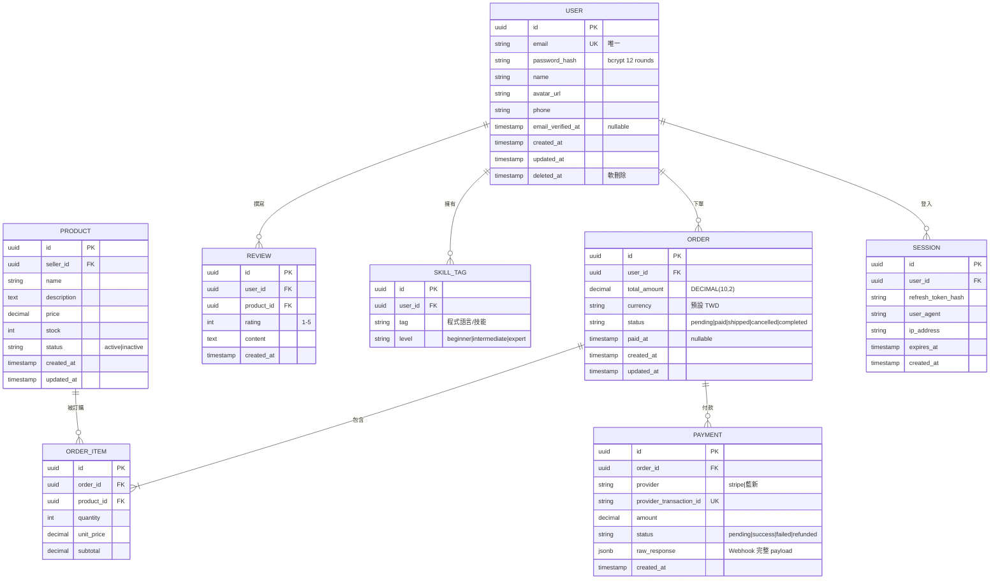

# [專案名稱] 資料庫結構(範本)

> **這是 system-architect 代理的交付物範本**。完整方法論見 `~/.hermes/profiles/system-architect/skills/system-architecture/SKILL.md` Step 5。
> 複製這個檔、把 `[...]` 佔位符替換成實際內容,完成後存到 `~/.hermes/handoff/<project-slug>/database-schema.md`。

---

建立日期:YYYY-MM-DD
負責代理:system-architect
對應架構文件:architecture.md §2 (容器圖)
資料庫選型:PostgreSQL 16

---

## §1 ER Diagram(實體關係圖)

---

## §2 資料表規格(每張表)

### 2.1 users(使用者主表)

| 欄位 | 型別 | 約束 | 預設 | 說明 |
|------|------|------|------|------|
| id | UUID | PK | gen_random_uuid() | 主鍵 |
| email | VARCHAR(255) | UNIQUE NOT NULL | | 登入 email |
| password_hash | VARCHAR(255) | NOT NULL | | bcrypt 12 rounds |
| name | VARCHAR(100) | NOT NULL | | 顯示名稱 |
| avatar_url | TEXT | | | CDN URL |
| phone | VARCHAR(20) | | | E.164 格式 |
| email_verified_at | TIMESTAMPTZ | | NULL | 信箱驗證時間 |
| created_at | TIMESTAMPTZ | NOT NULL | NOW() | 建立時間 |
| updated_at | TIMESTAMPTZ | NOT NULL | NOW() | 最後更新時間 |
| deleted_at | TIMESTAMPTZ | | NULL | 軟刪除時間 |

**索引**:
- `idx_users_email` UNIQUE on `(email)` — 登入查詢
- `idx_users_created_at` on `(created_at DESC)` — 後台列表

**分區策略**:暫不分區(< 1000 萬筆);超過則按 `created_at` 月分區。

### 2.2 orders(訂單主表)
[同上結構,每張表列欄位 + 約束 + 索引]

### 2.3 order_items(訂單明細)
[同上]

### 2.4 products(商品主表)
[同上]

### 2.5 payments(付款記錄)
[同上]

### 2.6 reviews(評價)
[同上]

### 2.7 skill_tags(技能標籤)
[同上]

### 2.8 sessions(登入工作階段)
[同上]

---

## §3 索引策略總覽

| 索引 | 類型 | 對應查詢 | 為何要 |
|------|------|---------|--------|
| `idx_users_email` | B-tree UNIQUE | 登入時查 email | 登入是最高頻查詢、必須 O(log n) |
| `idx_orders_user_id_created_at` | B-tree | 使用者後台查「我的訂單」 | 複合索引、按時間倒序 |
| `idx_orders_status_created_at` | B-tree | 商家後台查「待處理訂單」 | 部分索引可加 `WHERE status = 'paid'` |
| `idx_products_seller_id_status` | B-tree | 商家查「我上架的商品」 | 複合索引 |
| `idx_products_name` | GIN(trigram) | 商品搜尋 | 用 pg_trgm 加速 fuzzy match |
| `idx_reviews_product_id_created_at` | B-tree | 商品頁查評價、按時間排序 | 複合索引 |
| `idx_skill_tags_user_id` | B-tree | 個人主頁查技能標籤 | 高頻查詢 |
| `idx_sessions_refresh_token_hash` | B-tree UNIQUE | Token 刷新時驗證 | 安全高頻查詢 |
| `idx_payments_provider_transaction_id` | B-tree UNIQUE | Webhook 對帳 | 防止重複處理 |
| `idx_orders_paid_at_brin` | BRIN | 每日對帳報表 | 時間範圍查詢、BRIN 佔用空間小 |

**全文搜尋**(若有需要):
- `tsvector` 欄位 + GIN 索引
- 觸發器自動從 `name` + `description` 產生 `search_vector`

---

## §4 資料量估算

| 表 | 6 個月 | 1 年 | 3 年 | 對應成長策略 |
|----|--------|------|------|------------|
| users | 10 萬 | 50 萬 | 200 萬 | 100 萬後考慮分區 |
| orders | 50 萬 | 300 萬 | 1500 萬 | 100 萬後按月分區 |
| order_items | 200 萬 | 1200 萬 | 6000 萬 | 跟 orders 一起分區 |
| products | 5 萬 | 20 萬 | 80 萬 | 暫不分區 |
| reviews | 30 萬 | 150 萬 | 800 萬 | 軟刪除後 archive |
| skill_tags | 50 萬 | 250 萬 | 1000 萬 | 暫不分區 |
| payments | 50 萬 | 300 萬 | 1500 萬 | 跟 orders 一起分區 |
| sessions | 5 萬(active) | 20 萬 | 80 萬 | 過期自動清理 |

**儲存估算**(以每筆平均 1KB):
- 1 年總計:約 5-8 GB(包含索引)
- 3 年總計:約 20-30 GB(在 PostgreSQL 單機可承受範圍)

---

## §5 備份與還原策略

### 5.1 備份排程
- **每日凌晨 03:00**:全量 `pg_dump`(壓縮後約 500 MB)
- **每 15 分鐘**:WAL archiving(支援 Point-in-time recovery)
- **保留**:每日 7 份、每週 4 份、每月 6 份(共約 17 份全量)

### 5.2 還原演練
- **每月一次**:隨機挑一天的全量 + 對應 WAL 演練還原
- **驗證**:還原到 staging DB、跑 smoke test 確認資料完整性
- **RTO 目標**:1 小時(全量還原 + 套用 WAL)
- **RPO 目標**:15 分鐘(最多丟失 15 分鐘的 WAL)

### 5.3 災難恢復
- **跨區複製**:Master 在 ap-northeast-1、Replica 在 ap-southeast-1(15 秒內同步)
- **DNS failover**:用 Route53 health check 自動切換(< 60 秒)
- **Runbook**:見 `deployment-architecture.md` §6

---

## §6 給 engineering-lead 的「1 小時上手 checklist」

- [ ] 看完 ER Diagram 能在 ERD 工具(draw.io / dbdiagram.io)畫出來
- [ ] 看完每張表規格能在 `psql` 或 pgAdmin 內建表(SQL DDL 可從本檔 §2 產生)
- [ ] 知道哪些查詢走哪個索引(§3)
- [ ] 知道 1 年後資料量級距(§4)、知道什麼時候要分區
- [ ] 知道備份頻率跟還原 SLA(§5)
- [ ] 看完能在 1 小時內建立完整 dev DB

---

## §7 自我審查(交付前必跑)

- [ ] ER Diagram 包含所有 Must-have User Story 對應的實體?
- [ ] 每張表都有主鍵、外鍵、約束、預設值?
- [ ] 索引對應高頻查詢(登入、列表、搜尋)?
- [ ] 資料量估算有 6 個月 / 1 年 / 3 年三個時間點?
- [ ] 備份策略有 RTO / RPO 數字?
- [ ] §6 checklist 完整、可執行?

---

**版本**:v0.1 (初稿)
