# 技能/語言交換媒合平台 — Step 4 元件圖 (C4 Level 3)

**版本**: v0.1  
**日期**: 2026-06-10  
**負責代理**: architect-web-worker (Worker B)  
**承接自**: architecture-step1-2.md (Step 1-2) + _plan.md (Orchestrator)  
**預設技術選型**: 5 個盲點已採用 _plan.md 預設建議

---

## 1. C4 Level 3 元件圖 (Component Diagram)

```mermaid
graph TB
    %% ========================================
    %% C4 Level 3: 技能/語言交換媒合平台 元件圖
    %% Version: v0.1 (2026-06-10)
    %% 聚焦: 7 個核心元件, 3 層分層
    %% ========================================

    %% ===== API Layer (Controller) =====
    subgraph API_LAYER["📡 API Layer (Controller)"]
        direction TB
        AuthController["AuthController<br/>(/auth/*)"]
        UserController["UserController<br/>(/users/*)"]
        MatchingController["MatchingController<br/>(/matchings/*)"]
        OrderController["OrderController<br/>(/orders/*)"]
        ReviewController["ReviewController<br/>(/reviews/*)"]
        MediaController["MediaController<br/>(/media/*)"]
        NotificationController["NotificationController<br/>(/notifications/*)"]
    end

    %% ===== Service Layer (Business Logic) =====
    subgraph SERVICE_LAYER["⚙️ Service Layer (Business Logic)"]
        direction TB
        AuthService["AuthService<br/>• 登入/登出/註冊<br/>• JWT 發放與驗證<br/>• 雙重驗證(2FA)"]
        UserService["UserService<br/>• 會員資料管理<br/>• 技能上下架審核<br/>• 等級徽章計算"]
        SkillTagService["SkillTagService<br/>• 主技能 ≤3 / 副技能 ≤10<br/>• 雙向意願確認清單"]
        MatchingService["MatchingService<br/>• 匹配度 = (技能互補×80%)<br/>  + (時區/語言相容×20%)<br/>• 每週一 09:00 推送 3 個最佳配對"]
        OrderService["OrderService<br/>• 預約建立/取消<br/>• 違約金計算<br/>  (24h 前免扣/24h-1h 扣50%/時間到扣100%)"]
        PointEscrowService["PointEscrowService<br/>• 點數凍結/撥款/退款<br/>• 跨國匯率換算(週更新)<br/>• 審計 log 每筆"]
        ReviewService["ReviewService<br/>• 雙盲 1-5 星評分<br/>• 14 天評價窗口<br/>• 等級徽章經驗值更新"]
        MediaService["MediaService<br/>• 15 秒影片上傳/轉碼<br/>• 證件 AI 真偽檢查<br/>• 30 分鐘硬刪原始檔"]
        NotificationService["NotificationService<br/>• Email (SendGrid/Resend)<br/>• 推播 (FCM/APNs/WebPush)<br/>• 每週配對推薦通知"]
    end

    %% ===== Data Layer (Repository) =====
    subgraph DATA_LAYER["💾 Data Layer (Repository)"]
        direction TB
        AuthRepository["AuthRepository<br/>• users table<br/>• refresh_tokens table"]
        UserRepository["UserRepository<br/>• users table<br/>• skill_tags table<br/>• user_willingness table"]
        MatchingRepository["MatchingRepository<br/>• matchings table<br/>• match_scores table"]
        OrderRepository["OrderRepository<br/>• orders table<br/>• point_ledger table<br/>• audit_log table"]
        ReviewRepository["ReviewRepository<br/>• reviews table<br/>• review_blind_view"]
        MediaRepository["MediaRepository<br/>• media_metadata table<br/>• (原始檔 30 分鐘後 S3 刪除)"]
        NotificationRepository["NotificationRepository<br/>• notification_queue table<br/>• push_tokens table"]
    end

    %% ===== External Systems =====
    subgraph EXTERNAL["🌐 External Systems"]
        IDP["🆔 政府證件 AI 驗證<br/>(Onfido / Veriff)"]
        LIVENESS["👁️ 活體檢測 SDK"]
        PUSH["📱 推播服務<br/>(FCM + APNs)"]
        EMAIL["📧 Email 服務<br/>(SendGrid / Resend)"]
        STORAGE["☁️ 物件儲存<br/>(Supabase Storage + Cloudflare CDN)"]
        FX["💱 匯率 API<br/>(exchangerate-api)"]
    end

    %% ===== API → Service Relationships =====
    AuthController --> AuthService
    UserController --> UserService
    UserController --> SkillTagService
    MatchingController --> MatchingService
    OrderController --> OrderService
    OrderController --> PointEscrowService
    ReviewController --> ReviewService
    MediaController --> MediaService
    NotificationController --> NotificationService

    %% ===== Service → Repository Relationships =====
    AuthService --> AuthRepository
    UserService --> UserRepository
    SkillTagService --> UserRepository
    MatchingService --> MatchingRepository
    MatchingService --> UserRepository
    OrderService --> OrderRepository
    PointEscrowService --> OrderRepository
    ReviewService --> ReviewRepository
    MediaService --> MediaRepository
    NotificationService --> NotificationRepository

    %% ===== Service → External Relationships =====
    MediaService --> IDP
    MediaService --> LIVENESS
    MediaService --> STORAGE
    PointEscrowService --> FX
    NotificationService --> PUSH
    NotificationService --> EMAIL

    %% ===== Styles =====
    classDef controller fill:#d4e6f1,stroke:#1f618d,stroke-width:2px,color:#000
    classDef service fill:#e1f5e1,stroke:#2d7a2d,stroke-width:2px,color:#000
    classDef repository fill:#fff4e1,stroke:#cc8800,stroke-width:2px,color:#000
    classDef external fill:#f5e1e1,stroke:#a04040,stroke-width:2px,color:#000

    class AuthController,UserController,MatchingController,OrderController,ReviewController,MediaController,NotificationController controller
    class AuthService,UserService,SkillTagService,MatchingService,OrderService,PointEscrowService,ReviewService,MediaService,NotificationService service
    class AuthRepository,UserRepository,MatchingRepository,OrderRepository,ReviewRepository,MediaRepository,NotificationRepository repository
    class IDP,LIVENESS,PUSH,EMAIL,STORAGE,FX external
```



---

## 2. 元件職責表 (Component Responsibility Table)

### 2.1 API Layer (Controller)

| 元件 | 職責 | 對應 User Story | 呼叫 Service |
|------|------|-----------------|--------------|
| **AuthController** | 處理 /auth/* 請求(登入/註冊/登出/2FA/刷新 Token) | US-1-1, US-2-1 | AuthService |
| **UserController** | 處理 /users/* 請求(個人資料/技能管理/等級徽章) | US-1-1~3, US-2-1~2, US-3-1~2 | UserService, SkillTagService |
| **MatchingController** | 處理 /matchings/* 請求(配對結果/意願確認) | US-1-4, US-2-4, US-3-3 | MatchingService |
| **OrderController** | 處理 /orders/* 請求(預約/取消/確認完成) | US-1-5, US-2-5, US-3-4 | OrderService, PointEscrowService |
| **ReviewController** | 處理 /reviews/* 請求(雙盲評價/查看) | US-1-6, US-2-6, US-3-5 | ReviewService |
| **MediaController** | 處理 /media/* 請求(影片上傳/證件上傳/刪除) | US-1-2~3, US-2-2~3, US-3-2 | MediaService |
| **NotificationController** | 處理 /notifications/* 請求(推播設定/歷史) | US-1-7, US-2-7, US-3-6 | NotificationService |

### 2.2 Service Layer (Business Logic)

| 元件 | 職責 | 對應 User Story | 呼叫 Repository | 外部整合 |
|------|------|-----------------|-----------------|----------|
| **AuthService** | 登入/登出邏輯、JWT 發放與驗證、2FA 驗證、Token 刷新 | US-1-1, US-2-1 | AuthRepository | — |
| **UserService** | 會員 CRUD、技能上下架審核、等級徽章(銅/銀/金/鑽)計算、50+ 長者大字體 | US-1-1~3, US-2-1~2, US-3-1~2 | UserRepository | — |
| **SkillTagService** | 主技能 ≤3 / 副技能 ≤10 限制、雙向意願確認清單(願意教/想學) | US-1-4, US-2-4, US-3-3 | UserRepository | — |
| **MatchingService** | 匹配度公式 = (技能互補 × 80%) + (時區/語言相容 × 20%)、每週一 09:00 推送 3 個最佳配對 | US-1-4, US-2-4, US-3-3 | MatchingRepository, UserRepository | — |
| **OrderService** | 預約建立/取消、違約金計算(24h 前免扣 / 24h-1h 扣 50% / 時間到扣 100%)、24h 自動確認 | US-1-5, US-2-5, US-3-4 | OrderRepository | — |
| **PointEscrowService** | 點數凍結(預約時)/撥款(課程完成)/退款(取消)、跨國匯率換算(固定 USD 錨點,週更新)、審計 log | US-1-5, US-2-5, US-3-4 | OrderRepository | FX (匯率 API) |
| **ReviewService** | 雙盲 1-5 星評分(雙方 14 天內看不到對方評論)、等級徽章經驗值更新 | US-1-6, US-2-6, US-3-5 | ReviewRepository | — |
| **MediaService** | 影片上傳/轉碼(15 秒)、證件 AI 真偽檢查(第三方 SaaS)、30 分鐘硬刪原始檔、活體檢測(第三方 SDK) | US-1-2~3, US-2-2~3, US-3-2 | MediaRepository | IDP (證件驗證), LIVENESS (活體), STORAGE |
| **NotificationService** | Email 通知(SendGrid/Resend)、推播(FCM/APNs/WebPush)、每週配對推薦 | US-1-7, US-2-7, US-3-6 | NotificationRepository | PUSH, EMAIL |

### 2.3 Data Layer (Repository)

| 元件 | 職責 | 對應 Table | 索引策略 |
|------|------|-----------|----------|
| **AuthRepository** | 使用者認證資料、Refresh Token 管理 | users, refresh_tokens | users.email (unique), refresh_tokens.user_id |
| **UserRepository** | 會員資料、技能標籤、意願清單 | users, skill_tags, user_willingness | users.id, skill_tags.user_id, user_willingness.user_id |
| **MatchingRepository** | 配對結果、配對分數快取 | matchings, match_scores | matchings.user_id, matchings.status, match_scores.user_id |
| **OrderRepository** | 訂單、點數帳本(凍結/撥款/退款)、審計 log | orders, point_ledger, audit_log | orders.user_id, orders.status, point_ledger.user_id |
| **ReviewRepository** | 雙盲評價、14 天窗口管理 | reviews, review_blind_view | reviews.order_id, reviews.reviewer_id |
| **MediaRepository** | 媒體 metadata(原始檔路徑、驗證狀態、30 分鐘刪除標記) | media_metadata | media_metadata.user_id, media_metadata.type |
| **NotificationRepository** | 通知佇列、推播 Token 管理 | notification_queue, push_tokens | notification_queue.user_id, push_tokens.user_id |

---

## 3. 三層分層架構 (3-Layer Architecture)

```
┌─────────────────────────────────────────────────────────────┐
│                     API Layer (Controller)                   │
│  AuthController / UserController / MatchingController /     │
│  OrderController / ReviewController / MediaController /     │
│  NotificationController                                     │
├─────────────────────────────────────────────────────────────┤
│                     Service Layer (Business Logic)           │
│  AuthService / UserService / SkillTagService /              │
│  MatchingService / OrderService / PointEscrowService /      │
│  ReviewService / MediaService / NotificationService         │
├─────────────────────────────────────────────────────────────┤
│                     Data Layer (Repository)                   │
│  AuthRepository / UserRepository / MatchingRepository /     │
│  OrderRepository / ReviewRepository / MediaRepository /     │
│  NotificationRepository                                    │
└─────────────────────────────────────────────────────────────┘
```

### 層級職責原則

| 層級 | 職責 | 禁止事項 |
|------|------|----------|
| **API Layer** | HTTP 請求/回應、參數驗證、路由、認證攔截 | 禁止包含業務邏輯 |
| **Service Layer** | 業務邏輯、交易管理、跨 Repository 組合、外部服務呼叫 | 禁止直接處理 HTTP |
| **Data Layer** | DB CRUD、SQL 優化、索引管理、資料一致性 | 禁止包含業務邏輯 |

---

## 4. 元件通訊矩陣 (Component Communication Matrix)

| 呼叫方 \ 被呼叫方 | AuthService | UserService | SkillTagService | MatchingService | OrderService | PointEscrowService | ReviewService | MediaService | NotificationService |
|-----------------|-------------|-------------|-----------------|-----------------|--------------|-------------------|--------------|-------------|-------------------|
| **AuthController** | ✅ | | | | | | | | |
| **UserController** | | ✅ | ✅ | | | | | | |
| **MatchingController** | | | | ✅ | | | | | |
| **OrderController** | | | | | ✅ | ✅ | | | |
| **ReviewController** | | | | | | | ✅ | | |
| **MediaController** | | | | | | | | ✅ | |
| **NotificationController** | | | | | | | | | ✅ |
| **AuthService** | | | | | | | | | |
| **UserService** | | | | | | | | | |
| **MatchingService** | | ✅ | | | | | | | |
| **OrderService** | | | | | | ✅ | | | |
| **PointEscrowService** | | | | | | | | | |
| **ReviewService** | | | | | | | | | |
| **MediaService** | | | | | | | | | |
| **NotificationService** | | | | | | | | | |

---

## 5. 給工程師的元件命名對照表 (Service ↔ User Story Mapping)

| Service 名稱 | 負責的 User Story | 主要功能 |
|-------------|-------------------|---------|
| **AuthService** | US-1-1 (小美註冊登入), US-2-1 (佐藤登入) | 登入/註冊/JWT/2FA |
| **UserService** | US-1-1~3 (小美資料/技能/等級), US-2-1~2 (佐藤資料), US-3-1~2 (陳媽媽資料) | 會員 CRUD、技能上下架、等級徽章 |
| **SkillTagService** | US-1-4 (小美技能標籤), US-2-4 (佐藤技能), US-3-3 (陳媽媽技能) | 主技能 ≤3 / 副技能 ≤10、意願清單 |
| **MatchingService** | US-1-4 (小美配對), US-2-4 (佐藤跨國配對), US-3-3 (陳媽媽被動配對) | 匹配度計算、每週推送 |
| **OrderService** | US-1-5 (小美預約), US-2-5 (佐藤預約), US-3-4 (陳媽媽接受預約) | 預約/取消/24h 自動確認 |
| **PointEscrowService** | US-1-5 (小美點數), US-2-5 (佐藤跨國點數), US-3-4 (陳媽媽點數) | 點數凍結/撥款/退款、匯率換算 |
| **ReviewService** | US-1-6 (小美評價), US-2-6 (佐藤評價), US-3-5 (陳媽媽評價) | 雙盲評分、14 天窗口、經驗值 |
| **MediaService** | US-1-2~3 (小美證件+影片), US-2-2~3 (佐藤證件+影片), US-3-2 (陳媽媽證件) | 影片上傳/轉碼、證件 AI 驗證、30 分鐘刪除 |
| **NotificationService** | US-1-7 (小美通知), US-2-7 (佐藤通知), US-3-6 (陳媽媽通知) | Email、推播、每週配對通知 |

---

## 6. 技術備忘 (預設建議摘要)

| 盲點 | 預設建議 | 對應元件 |
|------|---------|----------|
| 1. 政府證件儲存 | 30 分鐘硬刪 + 遮罩證件號 | MediaService |
| 2. 跨國匯率 | 固定 USD 錨點 (週更新) | PointEscrowService |
| 3. 活體檢測 | 第三方 SDK (Onfido/Veriff) + 簡單眨眼 | MediaService |
| 4. 影片儲存 | Supabase Storage + Cloudflare CDN | MediaService |
| 5. 12 歲以下學員 | MVP 不開放 | — |

---

**Step 4 完成。等待主 session 整合 Worker A (容器圖) + Worker C (schema) + Worker D (API) 後,寫入 architecture.md。**
