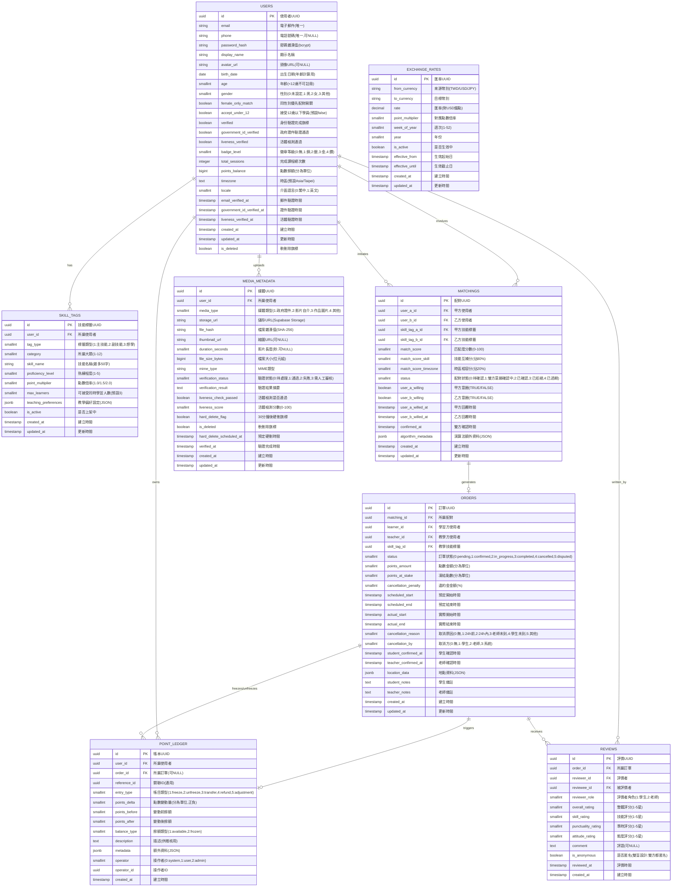

# 技能/語言交換平台 — Step 5 資料庫 Schema

**版本**: v0.1  
**建立日期**: 2026-06-10  
**負責代理**: architect-web-worker (Worker C)  
**產出**: `/home/hoonsoropenclaw/.hermes/handoff/skill-language-exchange-platform/_raw/architect/worker-C-database.md`

---

## 1. Mermaid erDiagram（ER 圖）



---

## 2. 8 張資料表規格

### 2.1 `users` — 使用者主表

| 欄位 | 型別 | 約束 | 索引 | 說明 |
|------|------|------|------|------|
| `id` | `UUID` | `PRIMARY KEY, DEFAULT gen_random_uuid()` | PK | 使用者UUID |
| `email` | `VARCHAR(255)` | `UNIQUE, NOT NULL` | B-tree | 電子郵件 |
| `phone` | `VARCHAR(20)` | `UNIQUE, NULL` | B-tree | 電話號碼(國際格式) |
| `password_hash` | `VARCHAR(255)` | `NOT NULL` | — | bcrypt 雜湊 |
| `display_name` | `VARCHAR(50)` | `NOT NULL` | — | 顯示名稱 |
| `avatar_url` | `TEXT` | `NULL` | — | 頭像URL |
| `birth_date` | `DATE` | `NULL` | — | 出生日期(年齡計算用) |
| `age` | `SMALLINT` | `CHECK (age >= 0 AND age <= 120)` | — | 年齡(**< 12 歲不可註冊**) |
| `gender` | `SMALLINT` | `CHECK (gender IN (0,1,2,3))` | B-tree | 0:未設定,1:男,2:女,3:其他 |
| `female_only_match` | `BOOLEAN` | `DEFAULT FALSE` | B-tree | 同性別優先配對(預設false) |
| `accept_under_12` | `BOOLEAN` | `DEFAULT FALSE` | — | 接受12歲以下學員(v1預設false) |
| `verified` | `BOOLEAN` | `DEFAULT FALSE` | B-tree | 身份驗證完成 |
| `government_id_verified` | `BOOLEAN` | `DEFAULT FALSE` | B-tree | 政府證件驗證通過 |
| `liveness_verified` | `BOOLEAN` | `DEFAULT FALSE` | B-tree | 活體檢測通過 |
| `badge_level` | `SMALLINT` | `CHECK (badge_level IN (0,1,2,3,4))` | B-tree | 0:無,1:銅,2:銀,3:金,4:鑽 |
| `total_sessions` | `INTEGER` | `DEFAULT 0` | — | 完成課程次數 |
| `points_balance` | `BIGINT` | `DEFAULT 0, CHECK (points_balance >= 0)` | — | 點數餘額(分為單位) |
| `timezone` | `VARCHAR(50)` | `DEFAULT 'Asia/Taipei'` | — | 時區 |
| `locale` | `SMALLINT` | `DEFAULT 0` | — | 0:繁中,1:英文 |
| `email_verified_at` | `TIMESTAMPTZ` | `NULL` | — | 郵件驗證時間 |
| `government_id_verified_at` | `TIMESTAMPTZ` | `NULL` | — | 證件驗證時間 |
| `liveness_verified_at` | `TIMESTAMPTZ` | `NULL` | — | 活體驗證時間 |
| `created_at` | `TIMESTAMPTZ` | `DEFAULT NOW()` | B-tree | 建立時間 |
| `updated_at` | `TIMESTAMPTZ` | `DEFAULT NOW()` | — | 更新時間 |
| `is_deleted` | `BOOLEAN` | `DEFAULT FALSE` | — | 軟刪除 |

**盲點對應**:
- 盲點 5: `age` 欄位 + `CHECK (age >= 12)` 約束，< 12 歲不開放註冊
- 盲點 3: `liveness_verified` + `liveness_verified_at` 支援活體檢測

---

### 2.2 `skill_tags` — 技能標籤表

| 欄位 | 型別 | 約束 | 索引 | 說明 |
|------|------|------|------|------|
| `id` | `UUID` | `PRIMARY KEY, DEFAULT gen_random_uuid()` | PK | 技能UUID |
| `user_id` | `UUID` | `NOT NULL, FK → users(id)` | B-tree, GIN(JSON) | 所屬使用者 |
| `tag_type` | `SMALLINT` | `CHECK (tag_type IN (1,2,3))` | B-tree | 1:主技能(≤3個),2:副技能(≤10個),3:想學 |
| `category` | `SMALLINT` | `CHECK (category BETWEEN 1 AND 12)` | B-tree | 1-12大類 |
| `skill_name` | `VARCHAR(50)` | `NOT NULL` | — | 技能名稱 |
| `proficiency_level` | `SMALLINT` | `CHECK (proficiency_level BETWEEN 1 AND 5)` | — | 熟練度1-5 |
| `point_multiplier` | `DECIMAL(3,2)` | `CHECK (point_multiplier IN (1.0,1.5,2.0))` | — | 點數倍率 |
| `max_learners` | `SMALLINT` | `DEFAULT 3` | — | 可接受人數 |
| `teaching_preferences` | `JSONB` | `DEFAULT '{}'` | GIN | 教學偏好(JSON) |
| `is_active` | `BOOLEAN` | `DEFAULT TRUE` | B-tree | 是否上架 |
| `created_at` | `TIMESTAMPTZ` | `DEFAULT NOW()` | — | 建立時間 |
| `updated_at` | `TIMESTAMPTZ` | `DEFAULT NOW()` | — | 更新時間 |

**約束**:
- 主技能(主tag_type=1)每個用戶最多 3 個: `CHECK (COUNT(*) FILTER (WHERE tag_type=1) <= 3)`
- 副技能(主tag_type=2)每個用戶最多 10 個

---

### 2.3 `matchings` — 配對記錄表

| 欄位 | 型別 | 約束 | 索引 | 說明 |
|------|------|------|------|------|
| `id` | `UUID` | `PRIMARY KEY, DEFAULT gen_random_uuid()` | PK | 配對UUID |
| `user_a_id` | `UUID` | `NOT NULL, FK → users(id)` | B-tree | 甲方使用者 |
| `user_b_id` | `UUID` | `NOT NULL, FK → users(id)` | B-tree | 乙方使用者 |
| `skill_tag_a_id` | `UUID` | `FK → skill_tags(id)` | — | 甲方技能標籤 |
| `skill_tag_b_id` | `UUID` | `FK → skill_tags(id)` | — | 乙方技能標籤 |
| `match_score` | `SMALLINT` | `CHECK (match_score BETWEEN 0 AND 100)` | B-tree | 匹配度總分 |
| `match_score_skill` | `SMALLINT` | `CHECK (match_score_skill BETWEEN 0 AND 100)` | — | 技能互補分(佔80%) |
| `match_score_timezone` | `SMALLINT` | `CHECK (match_score_timezone BETWEEN 0 AND 100)` | — | 時區相容分(佔20%) |
| `status` | `SMALLINT` | `CHECK (status IN (0,1,2,3,4))` | B-tree | 0:待確認,1:確認中,2:已確認,3:已拒絕,4:過期 |
| `user_a_willing` | `BOOLEAN` | `NULL` | — | 甲方意願 |
| `user_b_willing` | `BOOLEAN` | `NULL` | — | 乙方意願 |
| `user_a_willed_at` | `TIMESTAMPTZ` | `NULL` | — | 甲方回覆時間 |
| `user_b_willed_at` | `TIMESTAMPTZ` | `NULL` | — | 乙方回覆時間 |
| `confirmed_at` | `TIMESTAMPTZ` | `NULL` | — | 雙方確認時間 |
| `algorithm_metadata` | `JSONB` | `DEFAULT '{}'` | GIN | 演算法額外資料 |
| `created_at` | `TIMESTAMPTZ` | `DEFAULT NOW()` | B-tree | 建立時間 |
| `updated_at` | `TIMESTAMPTZ` | `DEFAULT NOW()` | — | 更新時間 |

**匹配度公式**:
```
match_score = (match_score_skill * 0.8) + (match_score_timezone * 0.2)
```
- 雙向意願確認: `user_a_willing = TRUE AND user_b_willing = TRUE` → `status = 2`

---

### 2.4 `orders` — 預約訂單表

| 欄位 | 型別 | 約束 | 索引 | 說明 |
|------|------|------|------|------|
| `id` | `UUID` | `PRIMARY KEY, DEFAULT gen_random_uuid()` | PK | 訂單UUID |
| `matching_id` | `UUID` | `FK → matchings(id)` | B-tree | 所屬配對 |
| `learner_id` | `UUID` | `NOT NULL, FK → users(id)` | B-tree | 學習方 |
| `teacher_id` | `UUID` | `NOT NULL, FK → users(id)` | B-tree | 教學方 |
| `skill_tag_id` | `UUID` | `FK → skill_tags(id)` | — | 教學技能 |
| `status` | `SMALLINT` | `CHECK (status IN (0,1,2,3,4,5))` | B-tree | 0:pending,1:confirmed,2:in_progress,3:completed,4:cancelled,5:disputed |
| `points_amount` | `SMALLINT` | `NOT NULL, CHECK (points_amount > 0)` | — | 點數金額(分) |
| `points_at_stake` | `SMALLINT` | `NOT NULL` | — | 凍結點數 |
| `cancellation_penalty` | `SMALLINT` | `CHECK (cancellation_penalty IN (0,50,100))` | — | 違約金% |
| `scheduled_start` | `TIMESTAMPTZ` | `NOT NULL` | B-tree | 預定開始 |
| `scheduled_end` | `TIMESTAMPTZ` | `NOT NULL` | — | 預定結束 |
| `actual_start` | `TIMESTAMPTZ` | `NULL` | — | 實際開始 |
| `actual_end` | `TIMESTAMPTZ` | `NULL` | — | 實際結束 |
| `cancellation_reason` | `SMALLINT` | `CHECK (cancellation_reason IN (0,1,2,3,4,5))` | — | 取消原因 |
| `cancellation_by` | `SMALLINT` | `CHECK (cancellation_by IN (0,1,2,3))` | — | 取消方 |
| `student_confirmed_at` | `TIMESTAMPTZ` | `NULL` | — | 學生確認 |
| `teacher_confirmed_at` | `TIMESTAMPTZ` | `NULL` | — | 老師確認 |
| `location_data` | `JSONB` | `DEFAULT '{}'` | GIN | 地點JSON |
| `student_notes` | `TEXT` | `NULL` | — | 學生備註 |
| `teacher_notes` | `TEXT` | `NULL` | — | 老師備註 |
| `created_at` | `TIMESTAMPTZ` | `DEFAULT NOW()` | B-tree | 建立時間 |
| `updated_at` | `TIMESTAMPTZ` | `DEFAULT NOW()` | — | 更新時間 |

**狀態機**:
```
pending → confirmed → in_progress → completed
                ↘ cancelled
                ↘ disputed
```
- 違約金規則: 24h前=0%, 24h~1h=50%, <1h=100%

---

### 2.5 `point_ledger` — 點數帳本表

| 欄位 | 型別 | 約束 | 索引 | 說明 |
|------|------|------|------|------|
| `id` | `UUID` | `PRIMARY KEY, DEFAULT gen_random_uuid()` | PK | 帳本UUID |
| `user_id` | `UUID` | `NOT NULL, FK → users(id)` | B-tree | 所屬使用者 |
| `order_id` | `UUID` | `FK → orders(id), NULL` | B-tree | 所屬訂單 |
| `reference_id` | `UUID` | `NOT NULL` | — | 關聯ID(通用) |
| `entry_type` | `SMALLINT` | `CHECK (entry_type IN (1,2,3,4,5))` | B-tree | 1:freeze,2:unfreeze,3:transfer,4:refund,5:adjustment |
| `points_delta` | `BIGINT` | `NOT NULL` | — | 點數變動(分,可負) |
| `points_before` | `BIGINT` | `NOT NULL` | — | 變動前餘額 |
| `points_after` | `BIGINT` | `NOT NULL` | — | 變動後餘額 |
| `balance_type` | `SMALLINT` | `CHECK (balance_type IN (1,2))` | — | 1:available,2:frozen |
| `description` | `TEXT` | `NOT NULL` | — | 稽核描述 |
| `metadata` | `JSONB` | `DEFAULT '{}'` | GIN | 額外資料 |
| `operator` | `SMALLINT` | `CHECK (operator IN (0,1,2))` | — | 0:system,1:user,2:admin |
| `operator_id` | `UUID` | `NULL` | — | 操作者ID |
| `created_at` | `TIMESTAMPTZ` | `DEFAULT NOW()` | B-tree | 建立時間 |

**每筆交易皆需審計**:points_before + points_after 確保餘額正確

---

### 2.6 `reviews` — 評價表

| 欄位 | 型別 | 約束 | 索引 | 說明 |
|------|------|------|------|------|
| `id` | `UUID` | `PRIMARY KEY, DEFAULT gen_random_uuid()` | PK | 評價UUID |
| `order_id` | `UUID` | `NOT NULL, FK → orders(id)` | B-tree, UNIQUE(order_id,reviewer_role) | 所屬訂單 |
| `reviewer_id` | `UUID` | `NOT NULL, FK → users(id)` | B-tree | 評價者 |
| `reviewee_id` | `UUID` | `NOT NULL, FK → users(id)` | B-tree | 被評價者 |
| `reviewer_role` | `SMALLINT` | `CHECK (reviewer_role IN (1,2))` | — | 1:學生,2:老師 |
| `overall_rating` | `SMALLINT` | `CHECK (overall_rating BETWEEN 1 AND 5)` | B-tree | 整體1-5星 |
| `skill_rating` | `SMALLINT` | `CHECK (skill_rating BETWEEN 1 AND 5)` | — | 技能評分 |
| `punctuality_rating` | `SMALLINT` | `CHECK (punctuality_rating BETWEEN 1 AND 5)` | — | 準時評分 |
| `attitude_rating` | `SMALLINT` | `CHECK (attitude_rating BETWEEN 1 AND 5)` | — | 態度評分 |
| `comment` | `TEXT` | `NULL` | — | 評語 |
| `is_anonymous` | `BOOLEAN` | `DEFAULT TRUE` | — | 雙盲:始終為TRUE |
| `reviewed_at` | `TIMESTAMPTZ` | `NULL` | — | 評價時間 |
| `created_at` | `TIMESTAMPTZ` | `DEFAULT NOW()` | — | 建立時間 |

**雙盲設計**: `is_anonymous = TRUE` 永久，雙方看不到彼此的評語

---

### 2.7 `media_metadata` — 媒體 Metadata 表

| 欄位 | 型別 | 約束 | 索引 | 說明 |
|------|------|------|------|------|
| `id` | `UUID` | `PRIMARY KEY, DEFAULT gen_random_uuid()` | PK | 媒體UUID |
| `user_id` | `UUID` | `NOT NULL, FK → users(id)` | B-tree | 所屬使用者 |
| `media_type` | `SMALLINT` | `CHECK (media_type IN (1,2,3,4))` | B-tree | 1:證件,2:影片,3:作品,4:其他 |
| `storage_url` | `TEXT` | `NOT NULL` | — | **不存原始檔,只存URL** |
| `file_hash` | `VARCHAR(64)` | `NOT NULL` | B-tree | SHA-256 去重 |
| `thumbnail_url` | `TEXT` | `NULL` | — | 縮圖URL |
| `duration_seconds` | `INTEGER` | `NULL` | — | 影片長度(秒) |
| `file_size_bytes` | `BIGINT` | `NULL` | — | 檔案大小 |
| `mime_type` | `VARCHAR(100)` | `NOT NULL` | — | MIME類型 |
| `verification_status` | `SMALLINT` | `CHECK (verification_status IN (0,1,2,3))` | B-tree | 0:待處理,1:通過,2:失敗,3:需人工 |
| `verification_result` | `TEXT` | `NULL` | — | 驗證結果摘要 |
| `liveness_check_passed` | `BOOLEAN` | `NULL` | — | 活體檢測是否通過 |
| `liveness_score` | `SMALLINT` | `NULL, CHECK (liveness_score BETWEEN 0 AND 100)` | — | 活體分數 |
| `hard_delete_flag` | `BOOLEAN` | `DEFAULT FALSE` | B-tree | **30分鐘後硬刪旗標** |
| `is_deleted` | `BOOLEAN` | `DEFAULT FALSE` | — | 軟刪除 |
| `hard_delete_scheduled_at` | `TIMESTAMPTZ` | `NULL` | — | 預定硬刪時間 |
| `verified_at` | `TIMESTAMPTZ` | `NULL` | — | 驗證完成時間 |
| `created_at` | `TIMESTAMPTZ` | `DEFAULT NOW()` | B-tree | 建立時間 |
| `updated_at` | `TIMESTAMPTZ` | `DEFAULT NOW()` | — | 更新時間 |

**盲點對應**:
- 盲點 1: `file_hash` + `hard_delete_flag` + `hard_delete_scheduled_at`，30分鐘後硬刪原始檔
- 盲點 3: `liveness_check_passed` + `liveness_score` 活體檢測欄位
- 盲點 4: `storage_url` 存 Supabase Storage URL，原始檔在那邊

---

### 2.8 `exchange_rates` — 跨國匯率表

| 欄位 | 型別 | 約束 | 索引 | 說明 |
|------|------|------|------|------|
| `id` | `UUID` | `PRIMARY KEY, DEFAULT gen_random_uuid()` | PK | 匯率UUID |
| `from_currency` | `VARCHAR(3)` | `NOT NULL` | B-tree | 來源幣別(TWD/USD/JPY) |
| `to_currency` | `VARCHAR(3)` | `NOT NULL` | — | 目標幣別(固定USD錨點) |
| `rate` | `DECIMAL(12,6)` | `NOT NULL, CHECK (rate > 0)` | — | 匯率值 |
| `point_multiplier` | `DECIMAL(3,2)` | `CHECK (point_multiplier IN (1.0,1.5,2.0))` | — | 點數倍率 |
| `week_of_year` | `SMALLINT` | `NOT NULL, CHECK (week_of_year BETWEEN 1 AND 53)` | B-tree | 週次 |
| `year` | `SMALLINT` | `NOT NULL` | B-tree | 年份 |
| `is_active` | `BOOLEAN` | `DEFAULT FALSE` | B-tree | 是否生效中 |
| `effective_from` | `TIMESTAMPTZ` | `NOT NULL` | — | 生效起始日 |
| `effective_until` | `TIMESTAMPTZ` | `NULL` | — | 生效截止日 |
| `created_at` | `TIMESTAMPTZ` | `DEFAULT NOW()` | — | 建立時間 |
| `updated_at` | `TIMESTAMPTZ` | `DEFAULT NOW()` | — | 更新時間 |

**盲點對應**:
- 盲點 2: 固定 USD 錨點，週為單位更新

---

## 3. 索引策略總覽

### 3.1 B-tree 索引（高頻查詢）

| 表格 | 索引欄位 | 類型 | 用途 |
|------|----------|------|------|
| `users` | `email` | UNIQUE B-tree | 登入查詢 |
| `users` | `phone` | UNIQUE B-tree | 電話登入 |
| `users` | `government_id_verified` | B-tree | 驗證過濾 |
| `users` | `liveness_verified` | B-tree | 活體過濾 |
| `users` | `badge_level` | B-tree | 徽章排序 |
| `users` | `gender` | B-tree | 性別篩選 |
| `users` | `female_only_match` | B-tree | 同性別優先 |
| `skill_tags` | `user_id` | B-tree | 使用者技能列表 |
| `skill_tags` | `tag_type` | B-tree | 主/副技能篩選 |
| `skill_tags` | `category` | B-tree | 大類篩選 |
| `skill_tags` | `is_active` | B-tree | 上架狀態 |
| `matchings` | `user_a_id` | B-tree | 甲方配對查詢 |
| `matchings` | `user_b_id` | B-tree | 乙方配對查詢 |
| `matchings` | `status` | B-tree | 狀態篩選 |
| `matchings` | `match_score` | B-tree | 匹配度排序 |
| `matchings` | `created_at` | B-tree | 時間排序 |
| `orders` | `learner_id` | B-tree | 學生訂單查詢 |
| `orders` | `teacher_id` | B-tree | 老師訂單查詢 |
| `orders` | `status` | B-tree | 狀態篩選 |
| `orders` | `scheduled_start` | B-tree | 時間查詢 |
| `point_ledger` | `user_id` | B-tree | 使用者帳本 |
| `point_ledger` | `order_id` | B-tree | 訂單帳本 |
| `point_ledger` | `entry_type` | B-tree | 帳目類型篩選 |
| `reviews` | `order_id, reviewer_role` | UNIQUE B-tree | 防止重複評價 |
| `reviews` | `reviewer_id` | B-tree | 評價者查詢 |
| `reviews` | `reviewee_id` | B-tree | 被評者查詢 |
| `reviews` | `overall_rating` | B-tree | 評分排序 |
| `media_metadata` | `user_id` | B-tree | 使用者媒體 |
| `media_metadata` | `media_type` | B-tree | 類型篩選 |
| `media_metadata` | `verification_status` | B-tree | 驗證狀態 |
| `exchange_rates` | `from_currency` | B-tree | 幣別查詢 |
| `exchange_rates` | `(year, week_of_year)` | B-tree | 週匯率查詢 |
| `exchange_rates` | `is_active` | B-tree | 生效匯率 |

### 3.2 GIN 索引（JSON 欄位）

| 表格 | 欄位 | 用途 |
|------|------|------|
| `skill_tags` | `teaching_preferences` | JSON 教學偏好查詢 |
| `matchings` | `algorithm_metadata` | 演算法資料查詢 |
| `orders` | `location_data` | 地點 JSON 查詢 |
| `point_ledger` | `metadata` | 帳本 metadata 查詢 |

### 3.3 複合索引

| 表格 | 複合索引 | 用途 |
|------|----------|------|
| `skill_tags` | `(user_id, tag_type, is_active)` | 使用者技能列表 |
| `matchings` | `(user_a_id, status)` | 甲方待確認配對 |
| `matchings` | `(user_b_id, status)` | 乙方待確認配對 |
| `orders` | `(learner_id, status)` | 學生訂單狀態 |
| `orders` | `(teacher_id, status)` | 老師訂單狀態 |
| `reviews` | `(reviewee_id, overall_rating)` | 被評者評分查詢 |
| `exchange_rates` | `(from_currency, is_active, effective_from)` | 有效匯率查詢 |

---

## 4. 1 年資料量估算（3K MAU）

| 表格 | 單筆大小(估) | 1年筆數估算 | 1年容量估算 |
|------|-------------|-----------|-----------|
| `users` | ~1 KB | 10,000 (含流失) | ~10 MB |
| `skill_tags` | ~0.5 KB | 50,000 (人均5個) | ~25 MB |
| `matchings` | ~0.3 KB | 30,000 (配對嘗試) | ~9 MB |
| `orders` | ~0.5 KB | 12,000 (月1K*12) | ~6 MB |
| `point_ledger` | ~0.2 KB | 48,000 (每筆訂單4筆帳) | ~10 MB |
| `reviews` | ~0.3 KB | 12,000 (每訂單2筆) | ~4 MB |
| `media_metadata` | ~0.3 KB | 15,000 (人均1.5個) | ~5 MB |
| `exchange_rates` | ~0.1 KB | 156 (週52*3幣) | <1 MB |
| **總計** | | | **~70 MB** |

**索引額外開銷**: 約 50% 資料量 → ~105 MB  
**成長預留**: 3 倍 → ~315 MB（1 年總空間）

---

## 5. 備份策略

### 5.1 每日 pg_dump（全備份）

```bash
# 每日凌晨 3:00 UTC 執行
pg_dump -Fc -b -v -f /backups/daily/pg_dump_$(date +%Y%m%d).dump
```

### 5.2 WAL Archiving（Point-in-Time Recovery）

```ini
# postgresql.conf
wal_level = replica
max_wal_senders = 3
archive_mode = on
archive_command = 'cp %p /backups/wal/%f'
archive_timeout = 300  # 5 分鐘強制歸檔
```

### 5.3 備份保留策略

| 備份類型 | 保留時間 | 位置 |
|---------|---------|------|
| 每日全備份 | 30 天 | 本地 + S3 |
| 每週全備份 | 90 天 | S3 Glacier |
| WAL 歸檔 | 7 天 | 本地 |
| Point-in-time 恢復 | 7 天 | WAL + 全備份 |

### 5.4 還原測試

每季執行一次還原演練，確認 RTO < 4 小時。

---

## 6. 給 DBA 的 1 小時建表 SOP

> 假設：已安裝 PostgreSQL 14+、有 `psql` 存取權限

### 第 1 步：建立資料庫（5 分鐘）

```sql
CREATE DATABASE skill_exchange;
\c skill_exchange

-- 啟用必要擴充
CREATE EXTENSION IF NOT EXISTS "uuid-ossp";
CREATE EXTENSION IF NOT EXISTS "pgcrypto";
```

### 第 2 步：建立 Schema（10 分鐘）

按以下順序執行建表：

1. `users` — 先建（其他表 FK 依賴）
2. `skill_tags` — FK → users
3. `matchings` — FK → users, skill_tags
4. `orders` — FK → matchings, users
5. `point_ledger` — FK → users, orders
6. `reviews` — FK → orders, users
7. `media_metadata` — FK → users
8. `exchange_rates` — 無 FK 依賴

### 第 3 步：建立索引（10 分鐘）

```sql
-- 見 §3.1 + §3.3 索引策略
-- 重點：高頻查詢欄位先建
CREATE INDEX idx_users_email ON users(email);
CREATE INDEX idx_users_government_id_verified ON users(government_id_verified);
CREATE INDEX idx_skill_tags_user_id ON skill_tags(user_id);
CREATE INDEX idx_matchings_user_a_id ON matchings(user_a_id);
CREATE INDEX idx_matchings_user_b_id ON matchings(user_b_id);
CREATE INDEX idx_orders_learner_id ON orders(learner_id);
CREATE INDEX idx_orders_teacher_id ON orders(teacher_id);
CREATE INDEX idx_point_ledger_user_id ON point_ledger(user_id);
CREATE INDEX idx_reviews_order_id ON reviews(order_id);
CREATE INDEX idx_media_metadata_user_id ON media_metadata(user_id);
```

### 第 4 步：建立 GIN 索引（5 分鐘）

```sql
-- JSON 欄位索引
CREATE INDEX idx_skill_tags_teaching_preferences ON skill_tags USING GIN(teaching_preferences);
CREATE INDEX idx_matchings_algorithm_metadata ON matchings USING GIN(algorithm_metadata);
CREATE INDEX idx_orders_location_data ON orders USING GIN(location_data);
CREATE INDEX idx_point_ledger_metadata ON point_ledger USING GIN(metadata);
```

### 第 5 步：建立 Trigger（10 分鐘）

```sql
-- 自動更新 updated_at
CREATE OR REPLACE FUNCTION update_updated_at()
RETURNS TRIGGER AS $$
BEGIN
    NEW.updated_at = NOW();
    RETURN NEW;
END;
$$ LANGUAGE plpgsql;

CREATE TRIGGER trg_users_updated_at
    BEFORE UPDATE ON users
    FOR EACH ROW EXECUTE FUNCTION update_updated_at();

CREATE TRIGGER trg_skill_tags_updated_at
    BEFORE UPDATE ON skill_tags
    FOR EACH ROW EXECUTE FUNCTION update_updated_at();

CREATE TRIGGER trg_matchings_updated_at
    BEFORE UPDATE ON matchings
    FOR EACH ROW EXECUTE FUNCTION update_updated_at();

CREATE TRIGGER trg_orders_updated_at
    BEFORE UPDATE ON orders
    FOR EACH ROW EXECUTE FUNCTION update_updated_at();

CREATE TRIGGER trg_media_metadata_updated_at
    BEFORE UPDATE ON media_metadata
    FOR EACH ROW EXECUTE FUNCTION update_updated_at();
```

### 第 6 步：建立約束（10 分鐘）

```sql
-- users 年齡約束（盲點5：<12歲不開放）
ALTER TABLE users ADD CONSTRAINT chk_users_age
    CHECK (age >= 12);

-- skill_tags 主/副技能數量約束（應用層控制，這裡僅提醒）
-- 主技能 ≤ 3，副技能 ≤ 10

-- orders 違約金約束
ALTER TABLE orders ADD CONSTRAINT chk_orders_cancellation_penalty
    CHECK (cancellation_penalty IN (0, 50, 100));

-- reviews 評分範圍約束
ALTER TABLE reviews ADD CONSTRAINT chk_reviews_rating
    CHECK (overall_rating BETWEEN 1 AND 5
       AND skill_rating BETWEEN 1 AND 5
       AND punctuality_rating BETWEEN 1 AND 5
       AND attitude_rating BETWEEN 1 AND 5);

-- exchange_rates 週次約束
ALTER TABLE exchange_rates ADD CONSTRAINT chk_exchange_rates_week
    CHECK (week_of_year BETWEEN 1 AND 53);
```

### 第 7 步：建立點數餘額觸發器（5 分鐘）

```sql
-- 點數帳本：每次新增帳本記錄，自動更新 users.points_balance
CREATE OR REPLACE FUNCTION update_user_points_balance()
RETURNS TRIGGER AS $$
BEGIN
    IF NEW.balance_type = 1 THEN  -- available
        UPDATE users SET points_balance = NEW.points_after
        WHERE id = NEW.user_id;
    ELSIF NEW.balance_type = 2 THEN  -- frozen
        -- frozen 餘額變動不影響可用餘額
        NULL;
    END IF;
    RETURN NEW;
END;
$$ LANGUAGE plpgsql;

CREATE TRIGGER trg_point_ledger_update_balance
    AFTER INSERT ON point_ledger
    FOR EACH ROW EXECUTE FUNCTION update_user_points_balance();
```

### 第 8 步：驗證（5 分鐘）

```sql
-- 驗證所有表格存在
SELECT table_name FROM information_schema.tables
WHERE table_schema = 'public'
ORDER BY table_name;

-- 驗證所有索引
SELECT indexname, tablename FROM pg_indexes
WHERE schemaname = 'public'
ORDER BY tablename, indexname;

-- 驗證所有 Trigger
SELECT trigger_name, event_object_table
FROM information_schema.triggers
WHERE event_object_schema = 'public';

-- 驗證約束
SELECT conname, conrelid::regclass AS table_name, pg_get_constraintdef(oid)
FROM pg_constraint
WHERE connamespace = 'public'::regnamespace
AND contype IN ('c', 'x')  -- CHECK and EXCLUDE
ORDER BY conrelid::regclass::text;
```

---

**建表 SOP 完成。預計時間：45-60 分鐘。**