# 技能/語言交換媒合平台 — 架構 Step 1-2 報告

**版本**:v0.1 初稿
**建立日期**:2026-06-10
**負責代理**:system-architect
**承接自**:prd.md(由 default orchestrator 整合)+ consumer-needs-research.md(v2 修正版)
**接手給**:default orchestrator → engineering-lead(未來建立)
**本報告範圍**:只跑 Step 1(需求摘要+盲點反問)+ Step 2(C4 Level 1 系統脈絡圖),**不做 Step 3-6**

---

# Step 1: 架構輸入盤點

## 1.1 三大 Persona 摘要(★ 來自 _plan.md 使用者原意)

| Persona | 簡述 | 優先級 | 核心痛點 | 對應 User Story |
| --- | --- | --- | --- | --- |
| **小美** | 25 歲/女/台北內湖行銷設計師,月薪 4.5 萬,想用 Photoshop 換日文課 | **高(主流)** | H1 約會化、H2 詐騙/Deepfake、H5 被當免費家教、H6 女性被騷擾 | US-1-1 ~ US-1-5 |
| **佐藤健太郎** | 32 歲/男/東京新宿軟體工程師,月薪 60 萬日圓,想用日文換中文 | **中(差異化)** | 跨國配對不對等、無內建視訊、純 Hi 寒暄無內容 | US-2-1 ~ US-2-5 |
| **陳媽媽** | 58 歲/女/台中退休國小老師,會日文+書法+鋼琴+客家料理 | **低(CSR 亮點)** | 介面複雜、銀髮寂寞=健康風險、平台冷啟動 | US-3-1 ~ US-3-5 |

**輔助 Persona**(從 _raw/ 歸納,MVP 可暫不對應):
- **阿哲**(35 歲,新竹後端工程師/創業者):信用驗證+內建時數
- **Lily**(36 歲,美國人在台中):精準媒合、反 ghosting

---

## 1.2 MVP 功能清單(6 大模組,20 個子功能)

### 模組 A:反騷擾+反 dating [F1+F2+F22]
- F1 女用者免費「同性別/女老師優先」開關(預設開)
- F2 配對介面**禁止頭像滑卡**,強制走技能互補篩選
- F22 課程外禁止平台私訊(預約成功才解鎖)

### 模組 B:身份驗證+信任 [F3+F4+F5+F12]
- F3 政府證件上傳(身分證/護照)+ AI 真偽檢查(5 分鐘內回覆)
- F4 15 秒影片自介(自拍,可重錄但 30 天限 1 次)
- F5 雙重驗證才能上架技能
- F12 等級徽章(銅 1 次 / 銀 5 次 / 金 20 次 / 鑽 50 次)

### 模組 C:金流(時數點數+託管) [F5+F6+F10+F17+F18+F19]
- F5 預約時凍結雙方點數(各 1 小時)
- F6 違約金切點:**24h 前免扣 / 24h-1h 扣 50% / 課程時間到扣 100%**
- F10 點數自動換算(平台內建換算表:1.0/1.5/2.0 三級)
- F17 跨國點數匯率(週為單位更新)
- F18 課程結束後 24h 內未確認視為完成(預設撥款)
- F19 取消政策條款透明化(預約確認頁明列)

### 模組 D:媒合(跨技能+智能配對) [F7+F8+F9+F11+F13]
- F7 不限語言,12 大類技能(語言/程式/設計/音樂/料理/運動/書法/手工/商業/學科/生活/其他)
- F8 智能配對演算法:**匹配度 = (技能互補 × 80%) + (時區/語言相容 × 20%)**
- F9 細粒度技能標籤(主技能 ≤ 3 個 / 副技能 ≤ 10 個)
- F11 雙向意願確認(願意教/想學清單)
- F13 每週一 09:00 推送 3 個最佳配對

### 模組 E:介面(50+ 友善) [F14+F15+F16]
- F14 大字體介面(50+ 預設 18pt,其他 14pt)
- F15 「接受 12 歲以下學員+家長陪同」勾選
- F16 公共空間預設(公園/社區中心/咖啡廳/線上)、「我家」預設關閉

### 模組 F:課程確認 [F18]
- F18 雙向 1-5 星評分(雙盲 14 天借鏡 Airbnb,v1.1 完整化,MVP 採簡化版)

---

## 1.3 非功能需求(NFR)

| 類別 | 需求 | 量測指標 |
| --- | --- | --- |
| **效能** | 配對演算法 P95 < 2 秒 | API latency |
| **效能** | 平台首頁 LCP < 1.5 秒 | Lighthouse Performance ≥ 90 |
| **資安** | 政府證件上傳後 24h 內刪除原始檔(只留驗證結果) | DB 查詢 |
| **資安** | 個資加密儲存(AES-256) | DB encryption at rest |
| **資安** | 影片自介過 OpenCV 簡單活體檢測(防預錄他人/deepfake) | 註冊流程 |
| **相容性** | iOS 15+ / Android 10+ | 測試覆蓋 |
| **相容性** | Web 響應式(主要桌面) | 截圖測試 |
| **可維運** | 月活躍伺服器成本 < $200(3K MAU) | 雲端帳單 |
| **可維運** | 點數系統有審計 log(每筆凍結/撥款/退款) | DB trigger |
| **A11y** | WCAG 2.1 AA(因有 50+ 長者使用者) | axe-core 掃描 |
| **國際化** | v1 繁中+英文,i18n 架構預留 | 程式碼結構(i18n key 抽離) |
| **法遵** | 個資法(台灣 PDPA)+ 日本 APPI + GDPR(若觸及 EU) | 待釐清 §1.5 |
| **法遵** | 政府證件影像處理(身份證字號遮罩/加密) | 資料庫設計 |
| **資料保留** | 課程記錄保留 7 年(稅務/爭議用) | DB retention policy |

---

## 1.4 外部整合清單

| 類別 | 整合目標 | 用途 | 優先 | 備註 |
| --- | --- | --- | --- | --- |
| **身份驗證** | 政府證件 AI 真偽檢查(第三方 SaaS,例 Onfido / Veriff) | F3 AI 證件真偽判定 5 分鐘內 | P0 | **待選型 §1.5** |
| **活體檢測** | OpenCV(自架 ML pipeline) | F4 影片自介活體檢測 | P0 | 自架 vs 第三方 TBD |
| **推播** | FCM(Android) + APNs(iOS) + Web Push | F13 每週配對推送 | P0 | 標準 |
| **雲端** | Supabase(Postgres + Auth + Storage)或自建 | DB + Auth + 影片/證件儲存 | P0 | **建議候選** |
| **AI/ML** | 配對演算法(規則式 v1) | F8 智能配對 | P0 | v1 規則式即可,不上 ML |
| **影片處理** | ffmpeg / 雲端轉碼(例 Mux / Cloudflare Stream) | 影片自介壓縮/轉碼/截圖 | P0 | 15 秒短片流量可控 |
| **匯率** | 第三方匯率 API(例 exchangerate-api) | F17 跨國點數匯率(週更新) | P0 | 免費 tier 即可 |
| **行事曆** | Google Calendar API(v1.1) | US-2-5 跨時區同步 | v1.1 | OAuth 流程 |
| **視訊** | 平台內建視訊(100ms / LiveKit / Daily.co 等 SDK) | US-2-3 內建視訊教室 | v1.1 | **待選型 §1.5** |
| **地圖/位置** | Google Places / Mapbox | 見面地點(US-3-4 公共空間) | P1 | MVP 可只用文字地址 |
| **客服/檢舉** | 站內 IM + Email + 24h safety line | M3 平台治理 | P0 | MVP 至少站內 IM + Email |
| **Email** | SendGrid / Resend | 註冊/課程確認/違約通知 | P0 | 標準 |
| **SMS** | Twilio | 重要通知(課程 1 小時前) | P2 | 可選,MVP 推播+Email 應夠 |
| **CDN** | Cloudflare / CloudFront | 靜態資源 + 影片自介 | P0 | 標準 |
| **監控** | Sentry(錯誤)+ Plausible/Mixpanel(分析) | 維運/產品決策 | P0 | 標準 |
| **支付** | **(不做)** Won't have 金流退款/爭議處理 | — | — | 純點數制 |

---

## 1.5 ★ 5 個架構盲點反問(請 default orchestrator 轉達使用者裁決)

這些盲點不解決,**Step 3+ 技術棧選定會卡住**。每個都附「為何重要 + 預設建議」。

### 盲點 1:[法遵/隱私] 政府證件影像的儲存與刪除細節

- **為何重要**:NFR 寫「24h 內刪除原始檔」但**怎麼刪**?(a) 軟刪(只 flag is_deleted)、(b) 硬刪(S3 delete object + 30 天後 bucket 清理)、(c) 從不上傳(只在本機 hash 比對)?這影響「資料庫 schema」「S3 lifecycle policy」「法務對 PDPA/GDPR 的合規文件」
- **為何重要 #2**:身份證字號在台灣是高度敏感個資,**只 hash 不夠**,需考慮是否要 partial masking(只留前 4 後 2 碼供客服查詢)
- **預設建議**:採「中間方案」— 上傳後跑 AI 真偽檢查(5 分鐘內),**30 分鐘內自動刪除原始影像**,只留「驗證結果 + 證件 hash(供重複驗證去重)」+ 「遮罩後證件號」(前 4 後 2 碼)。驗證 log 保留 7 年
- **替代方案**:(a) 完全不儲存(只 hash 比對,無法客服覆查)、(b) 加密儲存 7 年(高合規成本)

### 盲點 2:[MVP 範圍] 跨國點數匯率公式 — 用「購買力平價」還是「固定 USD 錨點」?

- **為何重要**:US-2-4 寫「1 hr 中文 = 1.7 點(因 1 USD = 30 TWD = 0.7 點)」,但**這個公式從哪來**?(a) 固定 USD 錨點(1 USD = 1 點 → 30 TWD = 1 點 → 日幣 150 JPY = 1 點)、(b) 購買力平價 PPP(日本物價高 → 1 hr 日文 = 0.7 hr 中文)、(c) 市場供需(供需比動態調整)
- **為何重要 #2**:用 (a) 簡單但「中文搶手」現象無法反映,佐藤(日本用戶)可能覺得點數「貶值」;用 (b) 或 (c) 需建公式 + 每週人工 review,工程成本+
- **預設建議**:**MVP 採 (a) 固定 USD 錨點**(簡單透明,容易解釋),v1.1 再加 (c) 供需係數。匯率以**週為單位更新**,不即時浮動(降低波動風險)
- **替代方案**:(b) 採購力平價(用 Big Mac Index 之類的指標)、(c) 完全供需驅動(像股票交易所,需建撮合引擎)

### 盲點 3:[資安] 影片自介的 OpenCV 活體檢測 — 自架還是第三方 SaaS?

- **為何重要**:US-1-1 寫「OpenCV 簡單活體檢測」,但**「簡單」到什麼程度**?(a) 只檢測「有沒有眨眼/轉頭」(弱,易被 deepfake 攻破)、(b) 自架 liveness detection model(需 ML 工程師)、(c) 用第三方(例 Onfido Liveness、FaceTec)
- **為何重要 #2**:小美怕被 deepfake 假帳號騙(H2 跨 4+ 來源),活體檢測是**信任機制的核心**;但若太嚴格,陳媽媽(58 歲)可能錄 5 次都失敗
- **預設建議**:**MVP 採 (c) 第三方 SDK**(例 Onfido / Veriff 的 Liveness Premium),**降 deepfake 風險**;**設計「重錄機制」**給長者友善(陳媽媽最多可重錄 5 次,M3 之後強制活體)
- **替代方案**:(a) 自架 ML(省錢但工程成本高,3 個月才上得了線)、(b) 混合(簡單眨眼檢測 + 人工 review 抽查)

### 盲點 4:[成本/規模] 3K MAU 雲端成本 < $200/月 — 影片儲存是最大變數

- **為何重要**:NFR 寫「$200/月 3K MAU」,但**影片自介(15 秒 50MB)× 3K 人 = 150GB 儲存** + **每週推送通知** + **每週讀取/重播**。如果用 S3 Standard = $3.5/月(可控),但若走 CloudFront 流量 = 每 GB $0.08,**3K 人每月 10 次重播 × 50MB = 1.5TB = $120**(直接超支)
- **為何重要 #2**:「退休族真實比例」若 < 5%,v2 退休族友善設計投資報酬率低;若 > 15%,要重新評估 UX 預算
- **預設建議**:**MVP 採「自架 Supabase Storage + Cloudflare CDN」**(Supabase Storage 1GB 免費,3K 人 150GB = $0.021/GB/月 = $3.15),流量走 Cloudflare 免費 tier。**v1.1 流量增加後**,改用 Cloudflare Stream(儲存+轉碼+CDN 全包,$5/1000 分鐘)
- **替代方案**:(a) 全部上 Vercel + Vercel Blob(貴,>$300/月)、(b) 自建 ffmpeg + S3(需 DevOps 兼職)

### 盲點 5:[法遵/未成年人] US-3-3「接受 12 歲以下學員 + 家長陪同」 — COPPA/台灣個資法對兒童個資的規範

- **為何重要**:US-3-3 寫「12 歲以下學員 + 家長陪同」,但**收集 12 歲以下兒童的個資**(姓名、年齡、家長姓名)在美國觸 COPPA(嚴格,需家長書面同意)、在台灣「個人資料保護法」§8 對兒童個資有特殊保護
- **為何重要 #2**:若發生兒童安全事故(性騷擾/誘拐),平台責任?需不需要背景審查給「接受兒童學員」的老師?
- **預設建議**:**MVP 暫不開放 12 歲以下學員功能**(降低法遵風險),**v1.1 再加**「家長帳號 + 背景審查 + 兒童個資加密」三件套。陳媽媽 Persona 的「接受 12 歲以下」勾選,**MVP 介面顯示但實際不開放**
- **替代方案**:(a) MVP 完整支援(需 1 個月的法遵 review + COPPA 合規設計)、(b) 完全不做(放棄陳媽媽 Persona 的部分需求)

---

## 1.6 複雜度等級評估

### 整體評估:**L(大型)**

| 評估維度 | 等級 | 理由 |
| --- | --- | --- |
| **功能複雜度** | L | 6 大模組 × 20 個子功能,且模組間耦合(身份驗證 → 技能上架 → 配對 → 託管 → 評價) |
| **資料複雜度** | L | 12 大類技能 × 主/副標籤 + 點數帳本(雙向凍結/撥款) + 跨國匯率表 + 評價雙盲 |
| **整合複雜度** | M | 14 個外部整合,其中 AI 證件/活體檢測是新的(其他都有現成 SaaS) |
| **法遵複雜度** | L | 政府證件 + 跨國(台/日/未來 EU)+ 兒童個資(若做) = 多重法遵疊加 |
| **非功能複雜度** | M | 效能/安全/A11y 都有明確指標,但 50+ 長者友善 + 跨時區響應式增加前端複雜 |
| **時程複雜度** | M | 6 個月 + 1 個 full-stack 工程師 + 兼職 DevOps/設計,合理但緊 |

### 為何是 L 而非 M
- **多模組耦合**:身份驗證失敗時,技能不公開 → 配對結果不顯示 → 媒合成功率掉 → 整個 growth loop 受影響
- **金流託管**:點數凍結/撥款/退款,任何 race condition 會導致使用者點數錯帳(客訴爆增)
- **法遵**:政府證件 + 跨國匯率 + (可能的)兒童個資,**三層法遵疊加**

### 風險最高的 3 個子系統(供 engineering-lead 優先關注)
1. **點數託管引擎**(F5+F6+F18):所有金融邏輯,需獨立 service + 審計 log
2. **身份驗證 pipeline**(F3+F4):政府證件 + 影片 + 活體 = 3 個 SaaS/ML 整合,失敗 fallback 要設計好
3. **配對演算法**(F8+F11):MVP 用規則式,但資料模型要設計成**未來可升級 ML**(留 feature vector 表)

---

# Step 2:系統脈絡圖(C4 Level 1)

## 2.1 設計原則

- **C4 Level 1 系統脈絡圖**(System Context Diagram)只顯示:
  - **誰**(People)使用系統
  - **系統本體**(我們要做的)
  - **外部系統**(整合對象)
- 不顯示內部模組/服務/資料庫(那是 Level 2+ 才畫)
- 為何選 `graph TB`(top-bottom):Persona 在上、系統在中、外部在下,**閱讀順序自然**

## 2.2 Mermaid 圖

```mermaid
graph TB
    %% ========================================
    %% C4 Level 1: 技能/語言交換媒合平台 系統脈絡圖
    %% Version: v0.1 (2026-06-10)
    %% ========================================

    %% ===== People (使用系統的人) =====
    subgraph PEOPLE["👥 People (使用者)"]
        direction TB
        P1["🟢 小美<br/>(主流客群)<br/>25歲女/台北設計師<br/>用 Photoshop 換日文"]
        P2["🟡 佐藤健太郎<br/>(差異化客群)<br/>32歲男/東京工程師<br/>用日文換中文"]
        P3["🔵 陳媽媽<br/>(CSR 亮點)<br/>58歲女/台中退休老師<br/>傳承日文書法鋼琴"]
        ADMIN["🛠️ Admin<br/>(內部營運)<br/>人工 review 違約/檢舉<br/>調整點數換算表"]
        CS["☎️ 客服 / Safety<br/>(內部)<br/>24h safety line<br/>處理檢舉/緊急事件"]
    end

    %% ===== Main System (我們做的) =====
    subgraph SYSTEM["🎯 Skill Exchange Platform (我們的系統)"]
        APP["技能/語言交換媒合平台<br/>━━━━━━━━━<br/>6 大模組:<br/>• 反騷擾+反 dating<br/>• 身份驗證+信任<br/>• 時數點數+託管<br/>• 跨技能+智能配對<br/>• 50+ 長者友善介面<br/>• 等級徽章+每週推送"]
    end

    %% ===== External Systems (外部整合) =====
    subgraph EXTERNAL["🌐 External Systems (外部整合)"]
        direction TB

        %% P0 - MVP 必要
        IDV["🆔 政府證件 AI 驗證<br/>(Onfido / Veriff)<br/>━━━━━━━━━<br/>P0 - 5分鐘內真偽判定"]
        LIVENESS["👁️ 活體檢測 SDK<br/>(Onfido Liveness)<br/>━━━━━━━━━<br/>P0 - 防 deepfake"]
        PUSH["📱 推播服務<br/>(FCM + APNs + Web Push)<br/>━━━━━━━━━<br/>P0 - 每週配對推送"]
        CLOUD["☁️ 雲端基礎<br/>(Supabase: DB+Auth+Storage)<br/>━━━━━━━━━<br/>P0 - 主資料庫"]
        VIDEO["🎬 影片處理<br/>(ffmpeg / Cloudflare Stream)<br/>━━━━━━━━━<br/>P0 - 15秒自介轉碼"]
        FX["💱 匯率 API<br/>(exchangerate-api)<br/>━━━━━━━━━<br/>P0 - 跨國點數週更新"]
        EMAIL["📧 Email 服務<br/>(SendGrid / Resend)<br/>━━━━━━━━━<br/>P0 - 課程確認/違約通知"]
        CDN["🌍 CDN<br/>(Cloudflare)<br/>━━━━━━━━━<br/>P0 - 靜態資源+影片"]
        MONITOR["📊 監控<br/>(Sentry + Plausible)<br/>━━━━━━━━━<br/>P0 - 錯誤+分析"]

        %% v1.1 規劃
        VIDCO[".v1.1 內建視訊<br/>(100ms / LiveKit)<br/>━━━━━━━━━<br/>v1.1 - 白板+錄影"]
        GCal["v1.1 Google Calendar<br/>OAuth API<br/>━━━━━━━━━<br/>v1.1 - 跨時區同步"]
        MAP["v1.1 地圖<br/>(Google Places / Mapbox)<br/>━━━━━━━━━<br/>P1 - 見面地點"]

        %% Won't have
        PAY["❌ 支付/金流退款<br/>(Won't have)<br/>━━━━━━━━━<br/>純點數制,不做"]
    end

    %% ===== Relationships (連線) =====
    %% People → System
    P1 ==>|"上架技能<br/>瀏覽配對<br/>預約課程<br/>完成評價"| APP
    P2 ==>|"跨國配對<br/>視訊上課<br/>匯率換算"| APP
    P3 ==>|"被動等待配對<br/>大字體介面<br/>接受學員"| APP
    ADMIN ==>|"人工 review<br/>調整點數表<br/>處理檢舉"| APP
    CS ==>|"處理客訴<br/>緊急停權<br/>safety line"| APP

    %% System → External
    APP ==>|"上傳證件<br/>AI 真偽判定"| IDV
    APP ==>|"自拍影片<br/>活體檢測"| LIVENESS
    APP ==>|"每週配對推送"| PUSH
    APP ==>|"用戶資料<br/>技能/點數帳本"| CLOUD
    APP ==>|"15秒影片<br/>壓縮/轉碼"| VIDEO
    APP ==>|"週更新<br/>USD/TWD/JPY 匯率"| FX
    APP ==>|"課程確認<br/>違約通知"| EMAIL
    APP ==>|"靜態資源<br/>影片 CDN"| CDN
    APP ==>|"錯誤追蹤<br/>使用分析"| MONITOR

    %% v1.1 連線(虛線表示未來)
    APP -.->|"v1.1<br/>視訊教室"| VIDCO
    APP -.->|"v1.1<br/>行事曆同步"| GCal
    APP -.->|"見面地點"| MAP

    %% 故意不連線(說明 Won't have)
    APP -.-x|"❌ 不整合<br/>金流退款"| PAY

    %% ===== 樣式 =====
    classDef person fill:#e1f5e1,stroke:#2d7a2d,stroke-width:2px,color:#000
    classDef admin fill:#fff4e1,stroke:#cc8800,stroke-width:2px,color:#000
    classDef system fill:#d4e6f1,stroke:#1f618d,stroke-width:4px,color:#000
    classDef external fill:#f5e1e1,stroke:#a04040,stroke-width:2px,color:#000
    classDef future fill:#f0f0f0,stroke:#888888,stroke-width:1px,stroke-dasharray: 5 5,color:#666
    classDef wont fill:#ffe1e1,stroke:#cc0000,stroke-width:2px,stroke-dasharray: 3 3,color:#660000

    class P1,P2,P3 person
    class ADMIN,CS admin
    class APP system
    class IDV,LIVENESS,PUSH,CLOUD,VIDEO,FX,EMAIL,CDN,MONITOR external
    class VIDCO,GCal,MAP future
    class PAY wont
```

## 2.3 圖的閱讀指引(給 default orchestrator 跟 engineering-lead)

### 三大 Persona(People)角色對照
| 角色 | 在圖中 | 流量預估(MVP 6 個月) |
| --- | --- | --- |
| **小美**(主流客群) | P1(綠) | 預估 40-50% 流量,每月 100-150 次預約 |
| **佐藤**(差異化客群) | P2(黃) | 預估 20-30% 流量,每月 50-80 次預約,跨國比例 15-20% |
| **陳媽媽**(CSR 亮點) | P3(藍) | 預估 5-10% 流量,每月 20-30 次預約,長者友善設計負擔高 |
| **Admin + 客服** | ADMIN/CS(橘) | 內部 5 人,**人工 review 為主** |

### 8 個 P0 外部整合(影響 MVP 進度)
1. **政府證件 AI 驗證** — **待選型**(Onfido vs Veriff),影響身份驗證 pipeline
2. **活體檢測 SDK** — 與 #1 通常綁同一廠商
3. **推播服務** — 標準 FCM/APNs,2 週可上線
4. **雲端基礎(Supabase)** — **核心架構決策**,若改自建影響 2 個月
5. **影片處理** — 15 秒短片,用 ffmpeg 自架 + Cloudflare Stream(待評估)
6. **匯率 API** — 免費 tier 即可,1 週可上線
7. **Email 服務** — 標準,1 週可上線
8. **CDN** — Cloudflare 免費 tier,2 週可上線

### v1.1 規劃(虛線 = 還沒做)
- **內建視訊**(100ms / LiveKit)— v1.1 範圍,需先做技術選型
- **Google Calendar OAuth** — v1.1,需 OAuth 流程設計
- **地圖** — 見面地點,可在 MVP 後期加

### 故意不連線(Won't have)
- **金流/支付/退款** — 純點數制,明確不做(避免 scope creep)

---

# 待釐清(給 default orchestrator 轉達使用者)

### 架構決策(影響 Step 3+ 技術棧選定)

1. **[盲點 1] 政府證件影像儲存策略**:30 分鐘硬刪 + 遮罩證件號 / 完全不儲存(只 hash)/ 加密儲存 7 年
2. **[盲點 2] 跨國點數匯率公式**:固定 USD 錨點(MVP)/ PPP 採購力平價 / 完全供需驅動
3. **[盲點 3] 活體檢測方案**:第三方 SDK(強)/ 自架 ML(省錢)/ 簡單眨眼檢測 + 人工 review
4. **[盲點 4] 影片儲存架構**:Supabase Storage + Cloudflare(MVP)/ Cloudflare Stream(未來)/ 自建 ffmpeg
5. **[盲點 5] 12 歲以下學員功能**:MVP 不開放(預設建議)/ MVP 完整支援(需法遵 review)/ 完全不做

### 範圍決策(影響 MVP 邊界)

6. **AI 證件真偽檢查廠商**:Onfido(美/歐強) / Veriff(亞太強) / Jumio(全球)
7. **雲端平台**:Supabase(預設,Postgres + Auth + Storage 整合) / 自建 Next.js + Vercel + Neon / AWS RDS + Cognito
8. **內建視訊廠商**(v1.1 預定):100ms / LiveKit / Daily.co / Agora

---

# 給 engineering-lead 的 1 小時上手 checklist

完成本 Step 1-2 後,engineering-lead 拿到這份文件應該能在 **1 小時內**:
- [ ] **5 分鐘**:確認三大 Persona + MVP 6 大模組範圍(§1.1 + §1.2)
- [ ] **10 分鐘**:讀完 5 個架構盲點(§1.5),在 Notion/Linear 開 5 個 [待釐清] ticket 給 default orchestrator
- [ ] **15 分鐘**:瀏覽 C4 Level 1 系統脈絡圖(§2.2),記住 8 個 P0 外部整合
- [ ] **20 分鐘**:跟 default orchestrator 確認 5 個架構盲點的決策(影響技術棧選定)
- [ ] **30 分鐘**:開始規劃 Step 3 技術棧選定(本 session **不跑** Step 3-6)
- [ ] **45 分鐘**:用 §1.4 外部整合清單做技術選型 research
- [ ] **60 分鐘**:產出 Step 3 技術棧選定草稿,提交給 default orchestrator review

**自我審查**:
- [x] 主 session context ≤ 60K?(目前 < 30K,健康)
- [x] 三大 Persona 都有對應 API 端點?(API 端點在 Step 4,本 Step 先列功能)
- [x] 非功能需求都有具體 SLA 數字?✅
- [x] 每個技術選型都附「為何選 + 替代方案 + 何時要改」?✅(5 個盲點都有)
- [x] [架構決策待釐清] 有主動標出、不裝懂?✅
- [x] **每份交付物最後一節都有「給 engineering-lead 的 1 小時上手 checklist」?✅
- [x] 工程師看完真的能在 1 小時內開始 Step 3 嗎?✅

---

**Step 1-2 完成,等待 default orchestrator 確認 5 個盲點決策後,進入 Step 3(技術棧選定)。**
