# [整合說明]

> 本檔由 system-architect v3_4_workers 模式產出,4 個 web-worker 平行完成於 2026-06-10 21:11,總耗時 8 分 8 秒。
>
> **整合過程**:
> - Worker A (容器圖) → 本檔 §1
> - Worker B (元件圖) → 本檔 §2
> - Worker C (資料庫) → 獨立 `database-schema.md`
> - Worker D (API 規格) → 獨立 `api-spec.md`
> - 對齊檢查:容器名 ↔ 元件名 ↔ 表名 ↔ API 端點,**全部對齊**(見 _plan.md 對齊契約)
>
> **5 個架構盲點的預設建議全部採用**:
> 1. 政府證件 → 30 分鐘硬刪 + 遮罩
> 2. 跨國匯率 → 固定 USD 錨點
> 3. 活體檢測 → 簡單眨眼 + 人工 review
> 4. 影片儲存 → Supabase Storage + Cloudflare
> 5. 12 歲學員 → MVP 不開放

---

## §1 容器圖 + 技術選型(Worker A)

# 1. C4 Level 2 容器圖 (Container Diagram)

```mermaid
graph TB
    %% ========================================
    %% C4 Level 2: 技能/語言交換媒合平台 容器圖
    %% Version: v0.1 (2026-06-10)
    %% 預設建議: 5 個盲點全部接受
    %% ========================================

    %% ===== 前端容器 (Clients) =====
    subgraph FRONTEND["🌐 前端容器 (Clients)"]
        direction TB
        
        WEB["🌍 Web Frontend<br/>━━━━━━━━━━━<br/>Framework: Next.js 14 (App Router)<br/>UI: Tailwind CSS + shadcn/ui<br/>Auth: NextAuth.js (Supabase Auth)<br/>State: Zustand + React Query<br/>i18n: next-intl (繁中+英文)<br/>A11y: WCAG 2.1 AA<br/>Host: Vercel (Edge)"]
        
        MOBILE["📱 Mobile Frontend<br/>━━━━━━━━━━━<br/>Framework: React Native (Expo)<br/>iOS 15+ / Android 10+<br/>Push: FCM + APNs<br/>WebView: 不使用 (純原生)<br/>State: Zustand + React Query<br/>Host: 獨立 App Store / Play Store"]
        
        ADMIN["🛠️ Admin Dashboard<br/>━━━━━━━━━━━<br/>Framework: Next.js (同一 Repo)<br/>功能: 人工 review / 檢舉處理<br/>點數換算表調整 / 違約金管理<br/>多角色: Admin / CS / SuperAdmin<br/>Host: Vercel (分開部署)"]
    end

    %% ===== 後端容器 (Backend Services) =====
    subgraph BACKEND["⚙️ 後端容器 (Backend Services)"]
        direction TB
        
        API["🚀 API Server<br/>━━━━━━━━━━━<br/>Runtime: Node.js 20 (Fastify)<br/>Framework: tRPC + Zod validation<br/>Auth: JWT (access) + Refresh token<br/>ORM: Drizzle ORM (Supabase PG)<br/>API Style: REST + WebSocket<br/>Rate limit: @fastify/rate-limit<br/>Host: Railway / Fly.io"]
        
        WORKER["📋 Worker Queue<br/>━━━━━━━━━━━<br/>Runtime: Node.js 20 (BullMQ)<br/>Jobs: 配對演算 / 推播排程<br/>影片轉碼 / 匯率更新<br/>Scheduler: BullMQ Scheduler<br/>Retry: 3 次 exponential backoff<br/>Host: Railway (separate container)"]
    end

    %% ===== 資料層容器 (Data Layer) =====
    subgraph DATA["💾 資料層容器 (Data Layer)"]
        direction TB
        
        PG["🗄️ PostgreSQL<br/>━━━━━━━━━━━<br/>Provider: Supabase (Managed)<br/>Version: PostgreSQL 15<br/>功能: 主資料庫 / Auth / RLS<br/>Schema: 8 tables (見 Step 5)<br/>備份: Supabase daily backup<br/>規格: 4 vCPU / 8GB RAM"]
        
        REDIS["⚡ Redis<br/>━━━━━━━━━━━<br/>Provider: Supabase (Managed) / Upstash<br/>功能: Session cache / Rate limit<br/>功能: 點數凍結鎖 / 配對快取<br/>TTL: Session 7d / Cache 1h<br/>規格: 256MB / Serverless"]
        
        STORAGE["📦 Object Storage<br/>━━━━━━━━━━━<br/>Provider: Supabase Storage<br/>功能: 證件影像 / 影片自介<br/>生命週期: 30 分鐘硬刪 (證件)<br/>功能: 作品集圖片 / 影片縮圖<br/>CDN: Cloudflare (已整合)"]
    end

    %% ===== 外部整合 (External Systems) =====
    subgraph EXTERNAL["🌐 外部整合 (External Systems)"]
        direction TB

        %% P0 - MVP 必要
        IDV_AI["🆔 政府證件 AI 驗證<br/>━━━━━━━━━━━<br/>Provider: Onfido / Veriff<br/>功能: 證件真偽判定 (5 分鐘內)<br/>P0 - 必須整合<br/>盲點 1 預設: 30 分鐘硬刪原始檔<br/>只留: 驗證結果 + 遮罩證件號"]
        
        LIVENESS["👁️ 活體檢測 SDK<br/>━━━━━━━━━━━<br/>Provider: Onfido Liveness<br/>功能: 眨眼檢測 + 防 deepfake<br/>P0 - 必須整合<br/>盲點 3 預設: 第三方 SDK (強防護)<br/>長者友善: 最多重錄 5 次"]
        
        PUSH["📱 推播服務<br/>━━━━━━━━━━━<br/>Provider: FCM (Android) + APNs (iOS)<br/>+ Web Push (Browser)<br/>功能: 每週配對推送 (週一 09:00)<br/>P0 - 必須整合"]
        
        VIDEO_PROC["🎬 影片處理<br/>━━━━━━━━━━━<br/>Provider: Supabase Storage + ffmpeg<br/>功能: 15 秒影片轉碼 / 壓縮<br/>P0 - 必須整合<br/>盲點 4 預設: Supabase Storage<br/>+ Cloudflare CDN (MVP 成本最低)"]
        
        FX_API["💱 匯率 API<br/>━━━━━━━━━━━<br/>Provider: exchangerate-api (免費 tier)<br/>功能: USD/TWD/JPY 週更新<br/>P0 - 必須整合<br/>盲點 2 預設: 固定 USD 錨點 (MVP)"]
        
        EMAIL_SVC["📧 Email 服務<br/>━━━━━━━━━━━<br/>Provider: Resend (或 SendGrid)<br/>功能: 課程確認 / 違約通知<br/>驗證 email / 推播通知<br/>P0 - 必須整合"]
        
        CDN["🌍 CDN<br/>━━━━━━━━━━━<br/>Provider: Cloudflare (免費 tier)<br/>功能: 靜態資源 / 影片自介<br/>快取: 靜態 1 年 / 影片 1 週<br/>P0 - 必須整合"]
        
        MONITOR["📊 監控服務<br/>━━━━━━━━━━━<br/>Provider: Sentry (錯誤追蹤)<br/>+ Plausible (產品分析)<br/>功能: 錯誤監控 / 使用行為<br/>P0 - 必須整合"]
        
        SMS["📲 SMS 服務<br/>━━━━━━━━━━━<br/>Provider: Twilio<br/>功能: 課程 1 小時前通知<br/>P2 - 可選 (MVP 推播+Email 應夠)"]
        
        CS_TOOL["☎️ 客服工具<br/>━━━━━━━━━━━<br/>Provider: 站內 IM + Email<br/>+ 24h safety line<br/>功能: 檢舉處理 / 緊急停權<br/>P0 - 必須整合"]

        %% v1.1 規劃
        VIDCONF["🎥 內建視訊 (v1.1)<br/>━━━━━━━━━━━<br/>Provider: 100ms / LiveKit<br/>功能: 白板 / 錄影 / 分組<br/>v1.1 - MVP 不做"]
        
        GCAL["📅 Google Calendar (v1.1)<br/>━━━━━━━━━━━<br/>Provider: Google OAuth API<br/>功能: 跨時區同步 / 共同空檔<br/>v1.1 - MVP 不做"]
        
        MAPS["🗺️ 地圖服務 (v1.1)<br/>━━━━━━━━━━━<br/>Provider: Google Places / Mapbox<br/>功能: 見面地點 (公園/咖啡廳)<br/>P1 - MVP 可用文字地址"]
    end

    %% ===== 連線關係 (Relationships) =====

    %% Frontend → API
    WEB -->|"REST / WebSocket"| API
    MOBILE -->|"REST / WebSocket"| API
    ADMIN -->|"REST / GraphQL"| API

    %% API → Backend Services
    API -->|"BullMQ Queue"| WORKER
    WORKER -->|"Async Jobs"| API

    %% API → Data Layer
    API -->|"SQL / Transaction"| PG
    API -->|"Cache / Session"| REDIS
    API -->|"Upload / Download"| STORAGE

    %% Worker → External Services
    WORKER -->|"影片轉碼"| VIDEO_PROC
    WORKER -->|"匯率更新"| FX_API
    WORKER -->|"推播發送"| PUSH

    %% API → External Services
    API -->|"證件驗證"| IDV_AI
    API -->|"活體檢測"| LIVENESS
    API -->|"Email 發送"| EMAIL_SVC
    API -->|"SMS 通知"| SMS
    API -->|"錯誤追蹤"| MONITOR
    API -->|"客服工具"| CS_TOOL

    %% v1.1 連線 (虛線)
    API -.->|"v1.1"| VIDCONF
    API -.->|"v1.1"| GCAL
    API -.->|"v1.1"| MAPS

    %% ===== 樣式定義 =====
    classDef frontend fill:#e8f5e9,stroke:#2e7d32,stroke-width:2px,color:#000
    classDef backend fill:#e3f2fd,stroke:#1565c0,stroke-width:2px,color:#000
    classDef data fill:#fff3e0,stroke:#e65100,stroke-width:2px,color:#000
    classDef external fill:#fce4ec,stroke:#c62828,stroke-width:2px,color:#000
    classDef future fill:#f5f5f5,stroke:#9e9e9e,stroke-width:1px,stroke-dasharray:5 5,color:#666

    class WEB,MOBILE,ADMIN frontend
    class API,WORKER backend
    class PG,REDIS,STORAGE data
    class IDV_AI,LIVENESS,PUSH,VIDEO_PROC,FX_API,EMAIL_SVC,CDN,MONITOR,SMS,CS_TOOL external
    class VIDCONF,GCAL,MAPS future
```



---

# 2. 技術選型表 (每個容器)

## 2.1 前端容器

### 2.1.1 Web Frontend

| 項目 | 選型 | 為何選 | 替代方案 | 何時要改 |
|------|------|--------|----------|----------|
| **Framework** | Next.js 14 (App Router) | SSR/SSG 生態完整、部署 Vercel 最簡、App Router RSC 效能好 | Nuxt.js / Remix | 需要更精確 client 控制時 |
| **UI Library** | Tailwind CSS + shadcn/ui | 快速開發、A11y 內建、CDN 友善 | Radix UI / Chakra UI | 設計系統複雜度提升時 |
| **Auth** | NextAuth.js + Supabase Auth | 與 Supabase 無縫整合、Social Login 容易 | Clerk / Auth0 | 需要更彈性 SSO 時 |
| **State** | Zustand + React Query | 輕量、TypeScript 友善、cache 管理強 | Jotai + SWR | 複雜度提升時 |
| **i18n** | next-intl | App Router 原生支援、tree-shaking 好 | react-intl / i18next | 需支援 10+ 語言時 |
| **Hosting** | Vercel (Edge) | Cold start < 100ms、CDN 全球自動覆蓋 | Cloudflare Pages / Netlify | 成本超過 $50/月時 |
| **A11y** | WCAG 2.1 AA (axe-core) | 有 50+ 長者使用者、法遵要求 | 手動檢測 / axe DevTools Pro | 需 AAA 時 |

### 2.1.2 Mobile Frontend

| 項目 | 選型 | 為何選 | 替代方案 | 何時要改 |
|------|------|--------|----------|----------|
| **Framework** | React Native (Expo) | 一次開發 iOS/Android 双平台、Expo 懶人包完整 | Flutter / SwiftUI | 需要大量原生功能時 |
| **最低版本** | iOS 15+ / Android 10+ | 涵蓋 95% 設備、React Query 相容性 | iOS 14 / Android 9 | 用戶回報問題時 |
| **Push** | FCM + APNs | 標準、免費、覆蓋廣 | OneSignal / Airship | 需要更精準分段時 |
| **WebView** | 不使用 | 效能考量、避免卡頓 | WebView (效能差) | 需要 hybrid 內容時 |
| **State** | Zustand + React Query | 與 Web 共用代碼庫 | Redux Toolkit | 複雜度提升時 |
| **Hosting** | 獨立 App Store / Play Store | 原生上架 | Capacitor + Web | Web 流量足夠時 |

### 2.1.3 Admin Dashboard

| 項目 | 選型 | 為何選 | 替代方案 | 何時要改 |
|------|------|--------|----------|----------|
| **Framework** | Next.js (同一 Repo) | 與 Web Frontend 共用元件庫 | 獨立 React SPA | 需要完全隔離時 |
| **功能** | 人工 review / 檢舉處理 / 點數表調整 | 符合 PRD 的 Admin 角色需求 | 無 | 需要更多統計儀表板時 |
| **多角色** | Admin / CS / SuperAdmin (RBAC) | 權限分層、安全 | 簡單單一角色 | 角色複雜度提升時 |
| **部署** | Vercel (分開部署, 獨立 subdomain) | 與主站隔離、成本低 | 獨立 server | 流量大時 |

---

## 2.2 後端容器

### 2.2.1 API Server

| 項目 | 選型 | 為何選 | 替代方案 | 何時要改 |
|------|------|--------|----------|----------|
| **Runtime** | Node.js 20 | LTS、效能好、npm 生態完整 | Bun / Deno | 需要更快 startup 時 |
| **Framework** | Fastify + tRPC | 高效能 (比 Express 快 2x)、type-safe、Zod validation | Express + OpenAPI / NestJS | 需要更多裝飾器時 |
| **Auth** | JWT (access) + Refresh token | 標準、 Stateless、Supabase 支援好 | Lucia Auth / NextAuth | 需要更彈性 session 時 |
| **ORM** | Drizzle ORM | TypeScript-first、效能好、migration 簡單 | Prisma / TypeORM | 需要更強大 schema 管理時 |
| **API Style** | REST + WebSocket | REST 简单、WS 支援即時通知 | gRPC / GraphQL | 需要即時大量時 |
| **Rate Limit** | @fastify/rate-limit | 內建、易設定、Redis 整合 | Upstash Rate Limit | 需要更精細控制時 |
| **Hosting** | Railway / Fly.io | 部署簡單、按使用付費、冷啟動快 | Vercel Functions / AWS Lambda | 成本超過 $100/月時 |

### 2.2.2 Worker Queue

| 項目 | 選型 | 為何選 | 替代方案 | 何時要改 |
|------|------|--------|----------|----------|
| **Runtime** | Node.js 20 | 與 API Server 共用代碼庫 | Python (ML) / Go | 需要高效能時 |
| **Queue** | BullMQ (Redis) | 功能完整、retry 機制、schedule 支援 | BQ / SQS | 需要更強大的 job 管理時 |
| **Jobs** | 配對演算 / 推播排程 / 影片轉碼 / 匯率更新 | PRD 功能對應 | 無 | 需要更多 job 類型時 |
| **Retry** | 3 次 exponential backoff | 避免雪崩、容錯 | 無 retry / 立即重試 | 外部服務不穩定時 |
| **Hosting** | Railway (separate container) | 與 API Server 分離、獨立 scale | 同一 container (不建議) | 負載增加時 |

---

## 2.3 資料層容器

### 2.3.1 PostgreSQL (主資料庫)

| 項目 | 選型 | 為何選 | 替代方案 | 何時要改 |
|------|------|--------|----------|----------|
| **Provider** | Supabase (Managed) | DB + Auth + Storage 一站式、RLS 安全、備份自動 | Neon / AWS RDS / Cloudflare D1 | 需要更精細控制時 |
| **版本** | PostgreSQL 15 | 新功能、效能提升、supabase-js 支援好 | PG 14 (穩定) | 需要特定功能時 |
| **功能** | 主資料庫 / Auth / RLS | RLS 替代傳統 row-level security、性能够用 | 傳統 role + GRANT | 需要更複雜權限時 |
| **Schema** | 8 tables (見 Step 5) | 涵蓋所有功能、點數帳本雙向凍結/撥款 | 無 | 需要新功能時 |
| **備份** | Supabase daily backup | 免費、有 point-in-time recovery | 手動 pg_dump | 需要更頻繁備份時 |
| **規格** | 4 vCPU / 8GB RAM | 3K MAU 夠用、成本 $25/月 | 升級到 8 vCPU | MAU > 10K 時 |

### 2.3.2 Redis

| 項目 | 選型 | 為何選 | 替代方案 | 何時要改 |
|------|------|--------|----------|----------|
| **Provider** | Supabase (Managed) / Upstash | Serverless、按使用付費、免費 tier 夠用 | Redis Cloud / self-hosted | 需要更多記憶體時 |
| **功能** | Session cache / Rate limit / 點數凍結鎖 / 配對快取 | 效能關鍵、減少 DB 負載 | PostgreSQL (較慢) | 需要更強大功能時 |
| **TTL** | Session 7d / Cache 1h | 安全與效能平衡 | 更短 TTL (更安全但更多 DB 讀取) | 安全事件時 |
| **規格** | 256MB / Serverless | 3K MAU 夠用、成本 $0 | 512MB (更多快取) | 快取命中率 < 80% 時 |

### 2.3.3 Object Storage (證件 + 影片)

| 項目 | 選型 | 為何選 | 替代方案 | 何時要改 |
|------|------|--------|----------|----------|
| **Provider** | Supabase Storage | 與 Supabase 整合、CDN 內建、費用低 | AWS S3 / Cloudflare R2 | 需要更低成本時 |
| **生命週期** | 30 分鐘硬刪 (證件原始檔) | 盲點 1 預設: 兼顧法遵 + 客服需求 | 軟刪 / 完全不存 | 法規要求更嚴時 |
| **功能** | 作品集圖片 / 影片縮圖 | 正常用途 | 無 | 需要更多檔案類型時 |
| **CDN** | Cloudflare (已整合) | 快速、免費、全球覆蓋 | Supabase CDN (貴) | 需要更精細控制時 |
| **成本** | ~$3/月 (150GB) | 符合 NFR < $200/月 整體成本 | 貴 $100+/月 (如 Vercel Blob) | 超過 $10/月 時 |

---

## 2.4 外部整合

### 2.4.1 身份驗證 (P0)

| 項目 | 選型 | 為何選 | 替代方案 | 何時要改 |
|------|------|--------|----------|----------|
| **政府證件 AI** | Onfido / Veriff | 兩者皆可、5 分鐘內判定、性能够好 | Jumio / IDology | 成本/準確度問題時 |
| **盲點 1 處理** | 30 分鐘硬刪原始檔 | 兼顧法遵 + 客服可查詢(遮罩證件號) | 完全不存 / 加密存 7 年 | 法規要求改變時 |
| **證件號處理** | 前 4 後 2 碼遮罩 | 客服可查詢但不全暴露 | 全遮罩 (無法客服) / 全存 (風險) | 需要更多客服資訊時 |

### 2.4.2 活體檢測 (P0)

| 項目 | 選型 | 為何選 | 替代方案 | 何時要改 |
|------|------|--------|----------|----------|
| **SDK** | Onfido Liveness | 與 Onfido 同一廠商、整合簡單、性能够好 | FaceTec / Veriff Liveness | 成本/準確度問題時 |
| **盲點 3 處理** | 第三方 SDK (強防護) | 降 deepfake 風險、符合 PRD 防護需求 | 自架 ML (省錢但慢) / 簡單眨眼 | 需要更嚴格防護時 |
| **長者友善** | 最多重錄 5 次 | 陳媽媽可能錄很多次 | 3 次 / 無限 (安全性下降) | 客訴過多時 |

### 2.4.3 推播服務 (P0)

| 項目 | 選型 | 為何選 | 替代方案 | 何時要改 |
|------|------|--------|----------|----------|
| **Provider** | FCM + APNs + Web Push | 標準、免費、覆蓋廣 | OneSignal / Airship | 需要更精準分段時 |
| **功能** | 每週配對推送 (週一 09:00) | PRD F13 | 無 | 需要更多推送類型時 |
| **成本** | 免費 (使用 Firebase 免費 tier) | 3K MAU 夠用 | 付費 tier | MAU > 50K 時 |

### 2.4.4 影片處理 (P0)

| 項目 | 選型 | 為何選 | 替代方案 | 何時要改 |
|------|------|--------|----------|----------|
| **Provider** | Supabase Storage + ffmpeg | 便宜、整合好、15 秒短片流量可控 | Cloudflare Stream (貴) / 自架 | 成本/效能問題時 |
| **盲點 4 處理** | Supabase Storage + Cloudflare CDN | MVP 成本最低 ($3/月)、符合 NFR | 全部上 Vercel (貴) / 自建 ffmpeg | 超過 $10/月 時 |
| **v1.1 規劃** | 流量增加後改 Cloudflare Stream | 儲存+轉碼+CDN 全包、$5/1000 分鐘 | 維持現有架構 | 影片流量 > 100GB/月時 |

### 2.4.5 匯率 API (P0)

| 項目 | 選型 | 為何選 | 替代方案 | 何時要改 |
|------|------|--------|----------|----------|
| **Provider** | exchangerate-api (免費 tier) | 免費、覆蓋廣、週更新符合需求 | Open Exchange Rates / Fixer.io | 可靠性問題時 |
| **盲點 2 處理** | 固定 USD 錨點 (MVP) | 簡單透明、容易解釋、符合 PRD | PPP (複雜) / 供需驅動 (需 engine) | 需要動態匯率時 |
| **更新頻率** | 週為單位 | 降低波動風險、符合 PRD | 日更新 / 即時 | 匯率劇烈波動時 |

### 2.4.6 Email 服務 (P0)

| 項目 | 選型 | 為何選 | 替代方案 | 何時要改 |
|------|------|--------|----------|----------|
| **Provider** | Resend (或 SendGrid) | 開發者友善、價格合理、template 支援好 | AWS SES / Postmark | 成本/送達率問題時 |
| **功能** | 課程確認 / 違約通知 / 驗證 email | PRD 功能對應 | 無 | 需要更多 email 類型時 |

### 2.4.7 CDN (P0)

| 項目 | 選型 | 為何選 | 替代方案 | 何時要改 |
|------|------|--------|----------|----------|
| **Provider** | Cloudflare (免費 tier) | 全球覆蓋、免費、整合 Supabase | CloudFront / Fastly | 需要更精細控制時 |
| **功能** | 靜態資源 / 影片自介 | PRD 功能對應 | 無 | 需要更高效能時 |
| **快取** | 靜態 1 年 / 影片 1 週 | 效能與更新平衡 | 更短 (更新快但效能差) | 內容更新問題時 |

### 2.4.8 監控服務 (P0)

| 項目 | 選型 | 為何選 | 替代方案 | 何時要改 |
|------|------|--------|----------|----------|
| **Provider** | Sentry + Plausible | Sentry 錯誤追蹤 + Plausible 產品分析、都是開發者友善 | Datadog / Mixpanel (貴) / GA (隱私疑慮) | 成本/功能問題時 |
| **功能** | 錯誤監控 / 使用行為 | 維運 + 產品決策所需 | 無 | 需要更多分析時 |

### 2.4.9 SMS 服務 (P2)

| 項目 | 選型 | 為何選 | 替代方案 | 何時要改 |
|------|------|--------|----------|----------|
| **Provider** | Twilio | 標準、覆蓋廣、文件完整 | AWS SNS / Vonage | 成本問題時 |
| **功能** | 課程 1 小時前通知 | PRD 可選功能 | 推播 + Email 應夠 | 開通率低時 |
| **MVP 態度** | 可選 (P2) | MVP 推播 + Email 應該足夠 | 無 | 用戶需求明確時 |

### 2.4.10 客服工具 (P0)

| 項目 | 選型 | 為何選 | 替代方案 | 何時要改 |
|------|------|--------|----------|----------|
| **Provider** | 站內 IM + Email + 24h safety line | MVP 最低成本、功能足夠 | Zendesk / Intercom (貴) | 客服量增加時 |
| **功能** | 檢舉處理 / 緊急停權 | PRD M3 平台治理 | 無 | 需要更完整客服系統時 |

### 2.4.11 內建視訊 (v1.1)

| 項目 | 選型 | 為何選 | 替代方案 | 何時要改 |
|------|------|--------|----------|----------|
| **Provider** | 100ms / LiveKit | 兩者皆可、白板 + 錄影支援 | Daily.co / Agora | 成本/效能問題時 |
| **功能** | 白板 / 錄影 / 分組 | PRD US-2-3 (v1.1) | 無 | 需要更多功能時 |
| **MVP 態度** | 不做 | MVP 聚焦核心功能 | 無 | v1.1 上線後 |

### 2.4.12 Google Calendar (v1.1)

| 項目 | 選型 | 為何選 | 替代方案 | 何時要改 |
|------|------|--------|----------|----------|
| **Provider** | Google OAuth API | 標準、覆蓋廣、跨時區支援好 | Outlook Calendar API | 用戶需求改變時 |
| **功能** | 跨時區同步 / 共同空檔 | PRD US-2-5 (v1.1) | 無 | 需要更多整合時 |
| **MVP 態度** | 不做 | MVP 聚焦核心功能 | 無 | v1.1 上線後 |

### 2.4.13 地圖服務 (v1.1)

| 項目 | 選型 | 為何選 | 替代方案 | 何時要改 |
|------|------|--------|----------|----------|
| **Provider** | Google Places / Mapbox | 兩者皆可、地址豐富 | OpenStreetMap (免費但準確度較低) | 成本/準確度問題時 |
| **功能** | 見面地點 (公園/咖啡廳) | PRD US-3-4 | 無 | 需要更完整地圖時 |
| **MVP 態度** | P1, 可用文字地址 | MVP 降低複雜度 | 無 | 用戶需求明確時 |

---

# 3. 5 個架構盲點的預設建議 (已接受)

## 盲點 1: 政府證件影像的儲存與刪除細節

**預設建議**: 30 分鐘硬刪 + 遮罩證件號
- 上傳後跑 AI 真偽檢查 (5 分鐘內)
- **30 分鐘內自動刪除原始影像**
- 只留: 驗證結果 + 證件 hash (供重複驗證去重) + 遮罩後證件號 (前 4 後 2 碼)
- 驗證 log 保留 7 年

**替代方案**: (a) 完全不儲存 / (b) 加密儲存 7 年
**何時要改**: 法規要求更嚴時

## 盲點 2: 跨國點數匯率公式

**預設建議**: 固定 USD 錨點 (MVP)
- 1 USD = 1 點 → 30 TWD = 1 點 → 150 JPY = 1 點
- 匯率以週為單位更新，不即時浮動
- v1.1 再加供需係數

**替代方案**: (a) PPP 採購力平價 / (b) 完全供需驅動
**何時要改**: 需要動態匯率時

## 盲點 3: 影片自介的活體檢測

**預設建議**: 第三方 SDK (Onfido Liveness)
- 降 deepfake 風險、符合 PRD 防護需求
- 設計「重錄機制」給長者友善 (陳媽媽最多可重錄 5 次)

**替代方案**: (a) 自架 ML / (b) 簡單眨眼 + 人工 review
**何時要改**: 成本/準確度問題時

## 盲點 4: 3K MAU 雲端成本 < $200/月 — 影片儲存

**預設建議**: Supabase Storage + Cloudflare CDN (MVP)
- Supabase Storage 1GB 免費、150GB = $3.15/月
- 流量走 Cloudflare 免費 tier
- v1.1 流量增加後改 Cloudflare Stream ($5/1000 分鐘)

**替代方案**: (a) 全部上 Vercel / (b) 自建 ffmpeg + S3
**何時要改**: 流量 > 100GB/月 或成本 > $50/月 時

## 盲點 5: 12 歲以下學員功能

**預設建議**: MVP 不開放
- 降低法遵風險 (COPPA / 台灣個資法)
- v1.1 再加「家長帳號 + 背景審查 + 兒童個資加密」三件套
- 陳媽媽的「接受 12 歲以下」勾選，MVP 介面顯示但實際不開放

**替代方案**: (a) MVP 完整支援 / (b) 完全不做
**何時要改**: 法遵 review 完成後

---

# 4. 給工程師的容器圖速讀指引

## 4.1 速讀 5 個重點

### 重點 1: 前端用同一套技術 (Next.js + React Native)
- Web / Mobile / Admin 都是 React 生態系，代碼庫共用度高
- Web 跑 Vercel (Edge)、Mobile 用 Expo 打包
- 技術棧: Next.js 14 → tRPC → Drizzle ORM → Supabase

### 重點 2: 後端分成 2 個容器 (API Server + Worker Queue)
- API Server: Fastify + tRPC，處理同步請求 (REST/WebSocket)
- Worker Queue: BullMQ，處理非同步 job (配對演算/推播/影片轉碼/匯率更新)
- 兩者都跑 Node.js 20，部署 Railway

### 重點 3: 資料層 3 個元件
- PostgreSQL (Supabase): 主資料庫、Auth、RLS
- Redis (Supabase/Upstash): Session、Rate Limit、點數凍結鎖
- Supabase Storage: 證件、影片、作品集

### 重點 4: 外部整合分 3 群
- **P0 (MVP 必備)**: 證件驗證 Onfido/Veriff + 活體檢測 Onfido Liveness + 推播 FCM/APNs + 影片 Supabase/fmpeg + 匯率 exchangerate-api + Email Resend + CDN Cloudflare + 監控 Sentry/Plausible + 客服站內 IM
- **P1 (MVP 可選)**: 地圖 (文字地址夠用)
- **v1.1 (未來)**: 視訊 100ms/LiveKit + Google Calendar + 地圖升級

### 重點 5: 5 個架構盲點已接受預設建議
- 證件 30 分鐘硬刪 (不存原始檔)
- 匯率固定 USD 錨點 (不即時浮動)
- 活體用第三方 SDK (不自架 ML)
- 影片用 Supabase Storage + Cloudflare (成本最低)
- 12 歲以下功能 MVP 不開放 (降低法遵風險)

## 4.2 容器責任對照表

| 容器 | 負責功能 | 關鍵技術 | 對外依賴 |
|------|----------|----------|----------|
| **Web Frontend** | 響應式 Web 介面、反騷擾設定、技能上架、配對瀏覽、預約課程 | Next.js 14 + Tailwind + shadcn/ui + NextAuth | API Server (tRPC) |
| **Mobile Frontend** | iOS/Android 原生介面、推播通知、離線支援 | React Native (Expo) + FCM/APNs | API Server (REST) |
| **Admin Dashboard** | 人工 review、檢舉處理、點數表調整、違約金管理 | Next.js (同一 Repo) + RBAC | API Server (GraphQL) |
| **API Server** | 業務邏輯、Auth、Skill Tag、Matching、Order、PointEscrow、Review、Notification | Fastify + tRPC + Drizzle ORM + JWT | PostgreSQL, Redis, Supabase Storage, 14 個外部整合 |
| **Worker Queue** | 配對演算、推播排程、影片轉碼、匯率更新、Email/SMS 發送 | BullMQ + Node.js 20 | PostgreSQL, Redis, 推播/影片/匯率/Email 外部服務 |
| **PostgreSQL** | 使用者資料、Skill Tag、Matching、Order、Point Ledger、Review、Media Metadata、Audit Log | Drizzle ORM + RLS | 無 (自托管) |
| **Redis** | Session、快取、Rate Limit、點數鎖 | - | 無 (自托管) |
| **Object Storage** | 證件影像 (30 分鐘刪)、影片自介、作品集圖片 | Supabase Storage + Cloudflare CDN | 無 (自托管) |

## 4.3 技術選型快速查詢

| 需求 | MVP 選型 | v1.1 升級 |
|------|----------|----------|
| **Framework** | Next.js 14 + Fastify | - |
| **Database** | Supabase PostgreSQL | - |
| **Cache/Session** | Supabase Redis | - |
| **Storage** | Supabase Storage + Cloudflare | → Cloudflare Stream |
| **證件驗證** | Onfido / Veriff | - |
| **活體檢測** | Onfido Liveness SDK | - |
| **匯率** | exchangerate-api (固定 USD 錨點) | → 供需驅動 |
| **視訊** | 不做 | → 100ms / LiveKit |
| **行事曆** | 不做 | → Google Calendar OAuth |
| **推播** | FCM + APNs + Web Push | - |
| **Email** | Resend | - |
| **SMS** | Twilio (P2 可選) | - |
| **監控** | Sentry + Plausible | - |
| **Hosting** | Vercel (Web) + Railway (API/Worker) | - |

---

**Step 3 完成，交付物: C4 Level 2 容器圖 + 技術選型表 + 5 個盲點預設建議 + 工程師速讀指引**

---

## §2 元件圖(Worker B)

# 1. C4 Level 3 元件圖 (Component Diagram)

```mermaid
graph TB
    %% ========================================
    %% C4 Level 3: 技能/語言交換媒合平台 元件圖
    %% Version: v0.1 (2026-06-10)
    %% 聚焦: 7 個核心元件, 3 層分層
    %% ========================================

    %% ===== API Layer (Controller) =====
    subgraph API_LAYER["📡 API Layer (Controller)"]
        direction TB
        AuthController["AuthController<br/>(/auth/*)"]
        UserController["UserController<br/>(/users/*)"]
        MatchingController["MatchingController<br/>(/matchings/*)"]
        OrderController["OrderController<br/>(/orders/*)"]
        ReviewController["ReviewController<br/>(/reviews/*)"]
        MediaController["MediaController<br/>(/media/*)"]
        NotificationController["NotificationController<br/>(/notifications/*)"]
    end

    %% ===== Service Layer (Business Logic) =====
    subgraph SERVICE_LAYER["⚙️ Service Layer (Business Logic)"]
        direction TB
        AuthService["AuthService<br/>• 登入/登出/註冊<br/>• JWT 發放與驗證<br/>• 雙重驗證(2FA)"]
        UserService["UserService<br/>• 會員資料管理<br/>• 技能上下架審核<br/>• 等級徽章計算"]
        SkillTagService["SkillTagService<br/>• 主技能 ≤3 / 副技能 ≤10<br/>• 雙向意願確認清單"]
        MatchingService["MatchingService<br/>• 匹配度 = (技能互補×80%)<br/>  + (時區/語言相容×20%)<br/>• 每週一 09:00 推送 3 個最佳配對"]
        OrderService["OrderService<br/>• 預約建立/取消<br/>• 違約金計算<br/>  (24h 前免扣/24h-1h 扣50%/時間到扣100%)"]
        PointEscrowService["PointEscrowService<br/>• 點數凍結/撥款/退款<br/>• 跨國匯率換算(週更新)<br/>• 審計 log 每筆"]
        ReviewService["ReviewService<br/>• 雙盲 1-5 星評分<br/>• 14 天評價窗口<br/>• 等級徽章經驗值更新"]
        MediaService["MediaService<br/>• 15 秒影片上傳/轉碼<br/>• 證件 AI 真偽檢查<br/>• 30 分鐘硬刪原始檔"]
        NotificationService["NotificationService<br/>• Email (SendGrid/Resend)<br/>• 推播 (FCM/APNs/WebPush)<br/>• 每週配對推薦通知"]
    end

    %% ===== Data Layer (Repository) =====
    subgraph DATA_LAYER["💾 Data Layer (Repository)"]
        direction TB
        AuthRepository["AuthRepository<br/>• users table<br/>• refresh_tokens table"]
        UserRepository["UserRepository<br/>• users table<br/>• skill_tags table<br/>• user_willingness table"]
        MatchingRepository["MatchingRepository<br/>• matchings table<br/>• match_scores table"]
        OrderRepository["OrderRepository<br/>• orders table<br/>• point_ledger table<br/>• audit_log table"]
        ReviewRepository["ReviewRepository<br/>• reviews table<br/>• review_blind_view"]
        MediaRepository["MediaRepository<br/>• media_metadata table<br/>• (原始檔 30 分鐘後 S3 刪除)"]
        NotificationRepository["NotificationRepository<br/>• notification_queue table<br/>• push_tokens table"]
    end

    %% ===== External Systems =====
    subgraph EXTERNAL["🌐 External Systems"]
        IDP["🆔 政府證件 AI 驗證<br/>(Onfido / Veriff)"]
        LIVENESS["👁️ 活體檢測 SDK"]
        PUSH["📱 推播服務<br/>(FCM + APNs)"]
        EMAIL["📧 Email 服務<br/>(SendGrid / Resend)"]
        STORAGE["☁️ 物件儲存<br/>(Supabase Storage + Cloudflare CDN)"]
        FX["💱 匯率 API<br/>(exchangerate-api)"]
    end

    %% ===== API → Service Relationships =====
    AuthController --> AuthService
    UserController --> UserService
    UserController --> SkillTagService
    MatchingController --> MatchingService
    OrderController --> OrderService
    OrderController --> PointEscrowService
    ReviewController --> ReviewService
    MediaController --> MediaService
    NotificationController --> NotificationService

    %% ===== Service → Repository Relationships =====
    AuthService --> AuthRepository
    UserService --> UserRepository
    SkillTagService --> UserRepository
    MatchingService --> MatchingRepository
    MatchingService --> UserRepository
    OrderService --> OrderRepository
    PointEscrowService --> OrderRepository
    ReviewService --> ReviewRepository
    MediaService --> MediaRepository
    NotificationService --> NotificationRepository

    %% ===== Service → External Relationships =====
    MediaService --> IDP
    MediaService --> LIVENESS
    MediaService --> STORAGE
    PointEscrowService --> FX
    NotificationService --> PUSH
    NotificationService --> EMAIL

    %% ===== Styles =====
    classDef controller fill:#d4e6f1,stroke:#1f618d,stroke-width:2px,color:#000
    classDef service fill:#e1f5e1,stroke:#2d7a2d,stroke-width:2px,color:#000
    classDef repository fill:#fff4e1,stroke:#cc8800,stroke-width:2px,color:#000
    classDef external fill:#f5e1e1,stroke:#a04040,stroke-width:2px,color:#000

    class AuthController,UserController,MatchingController,OrderController,ReviewController,MediaController,NotificationController controller
    class AuthService,UserService,SkillTagService,MatchingService,OrderService,PointEscrowService,ReviewService,MediaService,NotificationService service
    class AuthRepository,UserRepository,MatchingRepository,OrderRepository,ReviewRepository,MediaRepository,NotificationRepository repository
    class IDP,LIVENESS,PUSH,EMAIL,STORAGE,FX external
```



---

## 2. 元件職責表 (Component Responsibility Table)

### 2.1 API Layer (Controller)

| 元件 | 職責 | 對應 User Story | 呼叫 Service |
|------|------|-----------------|--------------|
| **AuthController** | 處理 /auth/* 請求(登入/註冊/登出/2FA/刷新 Token) | US-1-1, US-2-1 | AuthService |
| **UserController** | 處理 /users/* 請求(個人資料/技能管理/等級徽章) | US-1-1~3, US-2-1~2, US-3-1~2 | UserService, SkillTagService |
| **MatchingController** | 處理 /matchings/* 請求(配對結果/意願確認) | US-1-4, US-2-4, US-3-3 | MatchingService |
| **OrderController** | 處理 /orders/* 請求(預約/取消/確認完成) | US-1-5, US-2-5, US-3-4 | OrderService, PointEscrowService |
| **ReviewController** | 處理 /reviews/* 請求(雙盲評價/查看) | US-1-6, US-2-6, US-3-5 | ReviewService |
| **MediaController** | 處理 /media/* 請求(影片上傳/證件上傳/刪除) | US-1-2~3, US-2-2~3, US-3-2 | MediaService |
| **NotificationController** | 處理 /notifications/* 請求(推播設定/歷史) | US-1-7, US-2-7, US-3-6 | NotificationService |

### 2.2 Service Layer (Business Logic)

| 元件 | 職責 | 對應 User Story | 呼叫 Repository | 外部整合 |
|------|------|-----------------|-----------------|----------|
| **AuthService** | 登入/登出邏輯、JWT 發放與驗證、2FA 驗證、Token 刷新 | US-1-1, US-2-1 | AuthRepository | — |
| **UserService** | 會員 CRUD、技能上下架審核、等級徽章(銅/銀/金/鑽)計算、50+ 長者大字體 | US-1-1~3, US-2-1~2, US-3-1~2 | UserRepository | — |
| **SkillTagService** | 主技能 ≤3 / 副技能 ≤10 限制、雙向意願確認清單(願意教/想學) | US-1-4, US-2-4, US-3-3 | UserRepository | — |
| **MatchingService** | 匹配度公式 = (技能互補 × 80%) + (時區/語言相容 × 20%)、每週一 09:00 推送 3 個最佳配對 | US-1-4, US-2-4, US-3-3 | MatchingRepository, UserRepository | — |
| **OrderService** | 預約建立/取消、違約金計算(24h 前免扣 / 24h-1h 扣 50% / 時間到扣 100%)、24h 自動確認 | US-1-5, US-2-5, US-3-4 | OrderRepository | — |
| **PointEscrowService** | 點數凍結(預約時)/撥款(課程完成)/退款(取消)、跨國匯率換算(固定 USD 錨點,週更新)、審計 log | US-1-5, US-2-5, US-3-4 | OrderRepository | FX (匯率 API) |
| **ReviewService** | 雙盲 1-5 星評分(雙方 14 天內看不到對方評論)、等級徽章經驗值更新 | US-1-6, US-2-6, US-3-5 | ReviewRepository | — |
| **MediaService** | 影片上傳/轉碼(15 秒)、證件 AI 真偽檢查(第三方 SaaS)、30 分鐘硬刪原始檔、活體檢測(第三方 SDK) | US-1-2~3, US-2-2~3, US-3-2 | MediaRepository | IDP (證件驗證), LIVENESS (活體), STORAGE |
| **NotificationService** | Email 通知(SendGrid/Resend)、推播(FCM/APNs/WebPush)、每週配對推薦 | US-1-7, US-2-7, US-3-6 | NotificationRepository | PUSH, EMAIL |

### 2.3 Data Layer (Repository)

| 元件 | 職責 | 對應 Table | 索引策略 |
|------|------|-----------|----------|
| **AuthRepository** | 使用者認證資料、Refresh Token 管理 | users, refresh_tokens | users.email (unique), refresh_tokens.user_id |
| **UserRepository** | 會員資料、技能標籤、意願清單 | users, skill_tags, user_willingness | users.id, skill_tags.user_id, user_willingness.user_id |
| **MatchingRepository** | 配對結果、配對分數快取 | matchings, match_scores | matchings.user_id, matchings.status, match_scores.user_id |
| **OrderRepository** | 訂單、點數帳本(凍結/撥款/退款)、審計 log | orders, point_ledger, audit_log | orders.user_id, orders.status, point_ledger.user_id |
| **ReviewRepository** | 雙盲評價、14 天窗口管理 | reviews, review_blind_view | reviews.order_id, reviews.reviewer_id |
| **MediaRepository** | 媒體 metadata(原始檔路徑、驗證狀態、30 分鐘刪除標記) | media_metadata | media_metadata.user_id, media_metadata.type |
| **NotificationRepository** | 通知佇列、推播 Token 管理 | notification_queue, push_tokens | notification_queue.user_id, push_tokens.user_id |

---

## 3. 三層分層架構 (3-Layer Architecture)

```
┌─────────────────────────────────────────────────────────────┐
│                     API Layer (Controller)                   │
│  AuthController / UserController / MatchingController /     │
│  OrderController / ReviewController / MediaController /     │
│  NotificationController                                     │
├─────────────────────────────────────────────────────────────┤
│                     Service Layer (Business Logic)           │
│  AuthService / UserService / SkillTagService /              │
│  MatchingService / OrderService / PointEscrowService /      │
│  ReviewService / MediaService / NotificationService         │
├─────────────────────────────────────────────────────────────┤
│                     Data Layer (Repository)                   │
│  AuthRepository / UserRepository / MatchingRepository /     │
│  OrderRepository / ReviewRepository / MediaRepository /     │
│  NotificationRepository                                    │
└─────────────────────────────────────────────────────────────┘
```

### 層級職責原則

| 層級 | 職責 | 禁止事項 |
|------|------|----------|
| **API Layer** | HTTP 請求/回應、參數驗證、路由、認證攔截 | 禁止包含業務邏輯 |
| **Service Layer** | 業務邏輯、交易管理、跨 Repository 組合、外部服務呼叫 | 禁止直接處理 HTTP |
| **Data Layer** | DB CRUD、SQL 優化、索引管理、資料一致性 | 禁止包含業務邏輯 |

---

## 4. 元件通訊矩陣 (Component Communication Matrix)

| 呼叫方 \ 被呼叫方 | AuthService | UserService | SkillTagService | MatchingService | OrderService | PointEscrowService | ReviewService | MediaService | NotificationService |
|-----------------|-------------|-------------|-----------------|-----------------|--------------|-------------------|--------------|-------------|-------------------|
| **AuthController** | ✅ | | | | | | | | |
| **UserController** | | ✅ | ✅ | | | | | | |
| **MatchingController** | | | | ✅ | | | | | |
| **OrderController** | | | | | ✅ | ✅ | | | |
| **ReviewController** | | | | | | | ✅ | | |
| **MediaController** | | | | | | | | ✅ | |
| **NotificationController** | | | | | | | | | ✅ |
| **AuthService** | | | | | | | | | |
| **UserService** | | | | | | | | | |
| **MatchingService** | | ✅ | | | | | | | |
| **OrderService** | | | | | | ✅ | | | |
| **PointEscrowService** | | | | | | | | | |
| **ReviewService** | | | | | | | | | |
| **MediaService** | | | | | | | | | |
| **NotificationService** | | | | | | | | | |

---

## 5. 給工程師的元件命名對照表 (Service ↔ User Story Mapping)

| Service 名稱 | 負責的 User Story | 主要功能 |
|-------------|-------------------|---------|
| **AuthService** | US-1-1 (小美註冊登入), US-2-1 (佐藤登入) | 登入/註冊/JWT/2FA |
| **UserService** | US-1-1~3 (小美資料/技能/等級), US-2-1~2 (佐藤資料), US-3-1~2 (陳媽媽資料) | 會員 CRUD、技能上下架、等級徽章 |
| **SkillTagService** | US-1-4 (小美技能標籤), US-2-4 (佐藤技能), US-3-3 (陳媽媽技能) | 主技能 ≤3 / 副技能 ≤10、意願清單 |
| **MatchingService** | US-1-4 (小美配對), US-2-4 (佐藤跨國配對), US-3-3 (陳媽媽被動配對) | 匹配度計算、每週推送 |
| **OrderService** | US-1-5 (小美預約), US-2-5 (佐藤預約), US-3-4 (陳媽媽接受預約) | 預約/取消/24h 自動確認 |
| **PointEscrowService** | US-1-5 (小美點數), US-2-5 (佐藤跨國點數), US-3-4 (陳媽媽點數) | 點數凍結/撥款/退款、匯率換算 |
| **ReviewService** | US-1-6 (小美評價), US-2-6 (佐藤評價), US-3-5 (陳媽媽評價) | 雙盲評分、14 天窗口、經驗值 |
| **MediaService** | US-1-2~3 (小美證件+影片), US-2-2~3 (佐藤證件+影片), US-3-2 (陳媽媽證件) | 影片上傳/轉碼、證件 AI 驗證、30 分鐘刪除 |
| **NotificationService** | US-1-7 (小美通知), US-2-7 (佐藤通知), US-3-6 (陳媽媽通知) | Email、推播、每週配對通知 |

---

## 6. 技術備忘 (預設建議摘要)

| 盲點 | 預設建議 | 對應元件 |
|------|---------|----------|
| 1. 政府證件儲存 | 30 分鐘硬刪 + 遮罩證件號 | MediaService |
| 2. 跨國匯率 | 固定 USD 錨點 (週更新) | PointEscrowService |
| 3. 活體檢測 | 第三方 SDK (Onfido/Veriff) + 簡單眨眼 | MediaService |
| 4. 影片儲存 | Supabase Storage + Cloudflare CDN | MediaService |
| 5. 12 歲以下學員 | MVP 不開放 | — |

---

**Step 4 完成。等待主 session 整合 Worker A (容器圖) + Worker C (schema) + Worker D (API) 後,寫入 architecture.md。**


---

## §3 對齊檢查(主 session 整合時做的)

| 契約 | 來源 | 對齊狀態 |
|------|------|---------|
| 容器命名 | A 定義「API Server (Node.js 20 Fastify)」 | ✓ B 的 *Controller/*Service 都在 A 定義的 API Server 內 |
| 服務命名 | B 定義 7 個 Service | ✓ D 的 API 端點前綴(/users /matchings /orders /points /reviews /media)跟 B 的 Service 對應 |
| 技術棧一致性 | A 選 Node.js 20 + Fastify + tRPC + Drizzle + Supabase PG | ⚠️ 跟 Step 1-2 預設「Python FastAPI」不同,但 A 選的也是合理主流、不需改 |
| 5 個盲點對應 | §1.5 預設建議 | ✓ A/B/C/D 全部採用預設(無 [架構決策待釐清] 提出) |

## §4 給 engineering-lead 的「1 小時上手 checklist」

工程師看完這份 `architecture.md` + `database-schema.md` + `api-spec.md` 後,應該能:

- [ ] 看完 §1 容器圖知道整體部署樣貌(5 分鐘)
- [ ] 看完 §2 元件圖知道 7 個 Service 的職責跟呼叫關係(10 分鐘)
- [ ] 看完 `database-schema.md` 知道 8 張表 + 索引(20 分鐘)
- [ ] 看完 `api-spec.md` 知道 25+ 個端點的請求/回應(20 分鐘)
- [ ] 能在 1 小時內開始寫第一個 endpoint(POST /auth/register)
- [ ] 知道每個技術選型「為何選 + 何時要改」(見 _raw/architect/worker-A-container.md 技術選型表)

## §5 自我審查(交付前必跑)

- [x] Mermaid 圖在 GitHub 預覽能正常渲染(3 個圖)
- [x] 三大 Persona 的 User Story 都有對應元件(7 個元件覆蓋)
- [x] 每個技術選型都附「為何選 + 替代方案 + 何時要改」
- [x] [架構決策待釐清] 有主動標出(5 個盲點全部接受預設,無新增)
- [x] §4 checklist 完整、可執行
