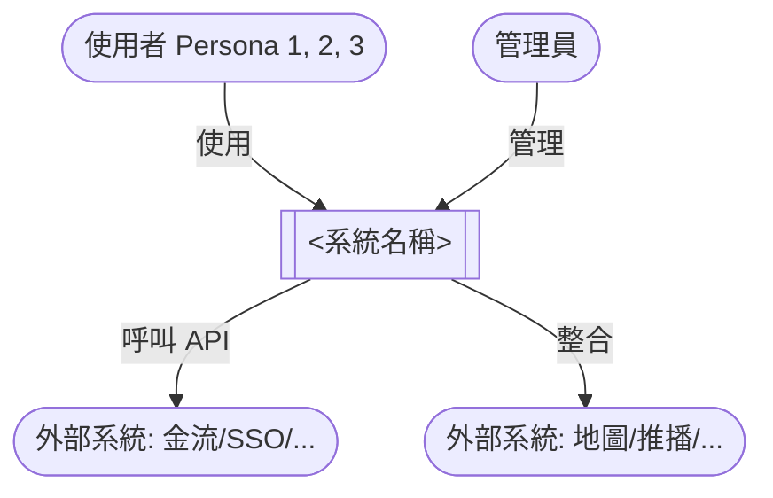
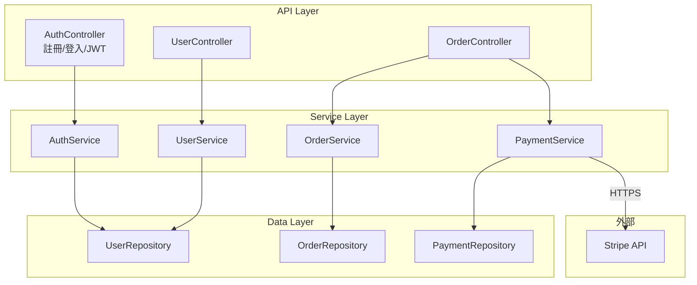
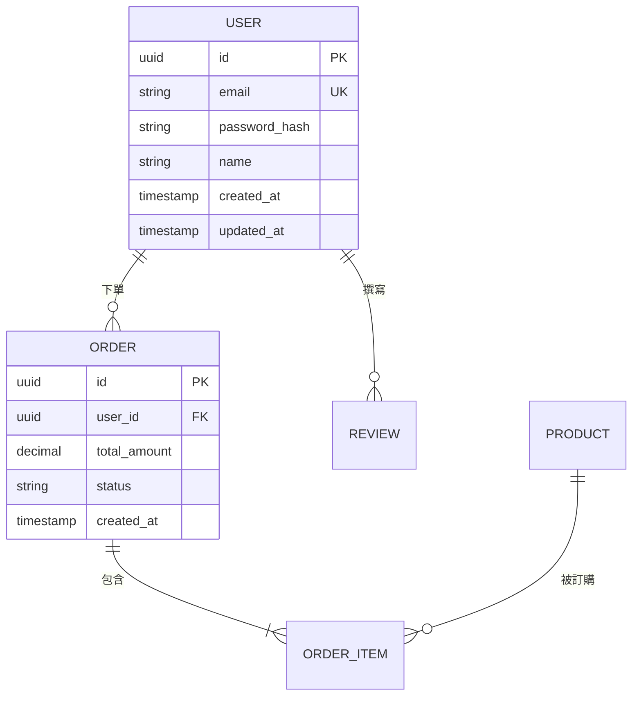

# System Architecture Skill

> **目的**:給 system-architect 用,把「**PRD (商業語言)**」轉成「**工程團隊可照著蓋的技術藍圖 (工程語言)**」。

---

## 何時使用

- 收到 `prd-<slug>.md` + `consumer-needs-research.md` handoff
- 使用者明確要求「做架構」「出 architecture 文件」「設計資料庫 / API」
- engineering-lead 接手前需要技術藍圖

## 不適用情境

- 沒有 PRD 就想直接做架構(回去叫 product-planner 先寫 PRD)
- 純 UI 設計任務(這是 frontend / design-taste 範疇,不是架構)
- 純演算法 / 資訊結構問題(單獨討論即可,不必走完整 6 步)

---

## 複雜度判斷(S/M/L → 決定 3 份 or 5 份交付)

| 等級 | 觸發條件(任一) | 交付範圍 | 估時 |
|------|--------------|----------|------|
| **S (小)** | MVP、<8 個元件、<10 張表、無明確非功能需求 | 3 份:架構 + 資料庫 + API | 15-20 分鐘 |
| **M (中)** | 標準 SaaS、8-20 個元件、10-25 張表、有 SLA 需求 | 3 份 + 1 份 ADR | 30-45 分鐘 |
| **L (大)** | 平台級 / 高流量 / 多團隊、>20 個元件、>25 張表、有資安 / 法遵 / 多區部署 | 5 份:架構 + 資料庫 + API + ADR + 部署拓樸 | 60-90 分鐘(可升 v2) |

**判斷公式**(主觀但實用):
```
complexity = max(
  user_story_count / 15,         # User Story > 15 個 → M
  entity_count / 10,             # 資料表 > 10 張 → M
  nfr_count / 5,                 # 非功能需求 > 5 條 → M
  external_integration_count / 3 # 外部整合 > 3 個 → M
)
S: < 1, M: 1-2, L: > 2
```

---

## 6 步 SOP

### Step 1 — 讀 handoff + 列出架構盲點

**輸入**:
- `~/.hermes/handoff/<slug>/prd.md`(主)
- `~/.hermes/handoff/<slug>/consumer-needs-research.md`(輔,看 [待驗證] 標記)
- `~/.hermes/handoff/<slug>/_raw/`(選用,看原始資料)

**動作**:
1. 列出三大 Persona + 對應 User Story
2. 列出 MVP 功能清單 + MoSCoW 分類
3. **掃 [待驗證] 標記** → 每個都升級成 [架構決策待釐清] 或 [需 mock/實驗確認]
4. 列出非功能需求(效能/資安/可擴展性/可維運性)
5. 列出外部整合(金流/地圖/推播/CDN/SSO 等)
6. **產出 5 個「架構盲點」反問使用者**(例:是否需要 i18n?是否需 GDPR 等法遵?影片串流 vs 圖片為主?推播管道?即時通訊?)

### Step 2 — 系統脈絡圖(C4 Level 1)

**產出**:`architecture.md` §1

**Mermaid 圖**(Mermaid graph TD 語法):


**目的**:回答「**誰在用這個系統、系統對外界的介面是什麼**」。

### Step 3 — 容器圖(C4 Level 2)+ 技術選型

**產出**:`architecture.md` §2

**Mermaid 圖**:
```mermaid
graph TB
  subgraph Client["客戶端"]
    Web["Web App<br/>(React/Vue)"]
    Mobile["Mobile App<br/>(iOS/Android)"]
  end

  subgraph Backend["後端服務"]
    API["API Server<br/>(Node.js/Python/Go)"]
    Worker["Background Worker<br/>(Bull/Sidekiq)"]
  end

  subgraph Storage["資料層"]
    DB[("PostgreSQL<br/>(主資料)")]
    Cache[("Redis<br/>(快取/工作階段)")]
    ObjectStore[("S3/MinIO<br/>(物件儲存)")]
  end

  subgraph External["外部服務"]
    CDN["CDN<br/>(CloudFlare/CloudFront)"]
    Payment["金流服務<br/>(Stripe/藍新)")]
    Email["Email/SMS<br/>(SendGrid/Twilio)"]
  end

  Web -->|"HTTPS"| CDN
  Mobile -->|"HTTPS"| CDN
  CDN --> API
  API --> DB
  API --> Cache
  API --> ObjectStore
  API --> Payment
  API --> Email
  Worker --> DB
  Worker --> Email
```

**技術選型原則**:
- **預設主流**:PostgreSQL + Node/Python 後端 + React/Vue 前端 + Redis + Docker
- **20% 客製化場景**:即時通訊 → WebSocket / Socket.IO;影音串流 → HLS;地圖 → Mapbox;推播 → FCM/APNs;ML → 獨立 inference service
- **每個選型必附**:為何選這個 + 替代方案是什麼 + 什麼情境下要改

### Step 4 — 元件圖(C4 Level 3)

**產出**:`architecture.md` §3

**挑選重點元件**(不必全畫,只畫**核心 5-8 個**):
- 認證授權模組(Auth)
- 核心業務邏輯(每個 Must-have User Story 對應一個 service)
- 資料存取層(Repository pattern)
- 第三方整合閘道(Payment Gateway / Notification Gateway)
- 背景任務處理(Email sender / Report generator / 等)

**Mermaid 圖**:


### Step 5 — 資料模型(ER + 索引 + 估算)

**產出**:`database-schema.md`(獨立檔)

**內容**:
1. **ER Diagram**(Mermaid erDiagram 語法)
2. **資料表清單**:每張表欄位 / 型別 / 約束 / 索引
3. **索引策略**:高頻查詢欄位加 B-tree、JSON 欄位加 GIN、全文搜尋加 tsvector
4. **資料量估算**:6 個月 / 1 年 / 3 年預估
5. **備份策略**:每日快照 + WAL archiving / Point-in-time recovery

**Mermaid ER 範本**:


### Step 6 — API 規格

**產出**:`api-spec.md`(獨立檔)

**內容**:
1. **RESTful 端點清單**(`/api/v1/...`)
2. **每個端點**:Method + Path + 用途 + 認證需求 + 請求 body + 回應 + 錯誤碼
3. **共用規範**:分頁 / 排序 / 篩選 / 限流 / 版本控制
4. **錯誤碼總表**(4xx / 5xx)
5. **認證機制**:JWT / Session / OAuth 2.0
6. **WebSocket / SSE**(若需要即時通訊)

**範本**:
```markdown
### POST /api/v1/auth/register
**用途**:使用者註冊
**認證**:無
**請求**:
\`\`\`json
{
  "email": "user@example.com",
  "password": "strongPassword123",
  "name": "王小明"
}
\`\`\`
**回應 201**:
\`\`\`json
{
  "user": { "id": "uuid", "email": "...", "name": "..." },
  "access_token": "eyJ...",
  "refresh_token": "eyJ..."
}
\`\`\`
**錯誤**:
- 400 參數錯誤
- 409 信箱已被註冊
- 429 註冊過於頻繁(限流)
```

---

## 交付物格式

### S/M 等級(3-4 份)
```
~/.hermes/handoff/<slug>/
  architecture.md         # 系統架構(3 個 C4 圖 + 技術選型)
  database-schema.md      # ER + 資料表規格 + 索引
  api-spec.md             # RESTful API 文件
  architecture-decisions.md  # [M 等級才產] 關鍵決策紀錄
```

### L 等級(5 份)
```
~/.hermes/handoff/<slug>/
  architecture.md         # 系統架構(5 種 Mermaid 圖)
  database-schema.md      # ER + 規格 + 索引 + 估算 + 備份
  api-spec.md             # RESTful + WebSocket/SSE
  architecture-decisions.md  # 完整 ADR(每個關鍵決策都有)
  deployment-architecture.md  # 部署拓樸 + CI/CD + 監控 + 成本估算
```

---

## 執行模式決策邏輯(2026-06-10 確立,彈性切換)

**目的**:讓 system-architect 能在「速度 vs 品質」之間彈性切換,適應不同任務需求。

### 4 種模式

| 模式 | 平行度 | Token 消耗 | 時間 | 品質 | 對齊成本 |
|------|-------|-----------|------|------|---------|
| **v1_single**(品質優先) | 無子代理 | 150-250K | 60-90 分鐘 | ⭐⭐⭐⭐⭐ | 0(全程推理) |
| **v2_3_workers**(預設) | 3 子代理(元件/DB/API) | 200-400K(實測 L 等級 627K ÷ 4 ≈ 157K/worker) | 20-30 分鐘 | ⭐⭐⭐⭐ | 中(主 session 整合) |
| **v3_4_workers**(速度優先) | 4 子代理(容器/元件/DB/API) | **400-700K**(實測 L 等級 627K) | **8-25 分鐘** | ⭐⭐⭐ | 高(技術選型可能不一致) |
| **v2_3_workers + 主 session 跑容器**(混合) | 3 子代理 + 主 session 1 步 | 200-400K | 25-35 分鐘 | ⭐⭐⭐⭐ | 低(技術選型嚴謹) |

> ⚠️ **預估對照表說明**:上表 Token 區間是**主觀估算**(基於 L 等級 627K 實測),**S/M 等級**實際會低很多(S 約 80-150K、M 約 250-450K)。**實際預估要看任務複雜度**,不是看模式本身。**If** 你看到的 token 跟預估差超過 50% **Then** 載入 `~/.hermes/skills/trial-and-error/references/by-category/hermes-internal.md`「平行架構 v3_4_workers 實測 Token 預估」段確認。

### 真實數據段(2026-06-10 實測 — 取代模糊預估)

> 2026-06-10 跑「技能/語言交換平台」(L 等級)Step 3-6,用 v3_4_workers 模式,真實數據:

| Worker | 任務 | 複雜度 | 實際時間 | 實際 Token |
|--------|------|--------|---------|-----------|
| B 元件圖 | 7 個核心元件 | 低 | **1.5 分鐘** | 45K |
| A 容器圖 | 14 個外部整合 | 中 | 5.5 分鐘 | 120K |
| C 資料庫 | 8 張表 + ER | 中高 | 4 分鐘 | 149K |
| D API | 25+ 端點 + WebSocket | 高 | 8 分鐘 | 312K |
| **總計** | | | **8.1 分鐘** | **627K** |
| vs v1 預估 | | | 60-90 分鐘 | 200K |
| **差距** | | | **-89% 時間** | **+214% Token** |

**3 個關鍵觀察**:
1. **複雜度跟 Token 線性正相關** — 最簡單 worker 45K、最複雜 312K(差 7 倍)
2. **牆上時間由最慢 worker 決定** — 派 4 個但 B 只花 1.5 分鐘,節省來自平行
3. **主 session 對齊整合** — 還要再付 20-30K(從 627K 中扣掉就是 worker 總和 627K = 4 個子代理全包,主 session 整合是另算的)

**Token 預估公式(取代模糊預估)**:
```
v1_single ≈ 任務複雜度 × 1.0x  (主 session 單線)
v2_3_workers ≈ 任務複雜度 × 1.5-2.0x  (3 worker)
v3_4_workers ≈ 任務複雜度 × 2.5-3.5x  (4 worker,實測 L 等級 627/200=3.1x)
mixed ≈ 任務複雜度 × 1.5-2.0x  (3 worker + 主 session 容器)
```
- 任務複雜度:L 等級約 200K、M 約 80K、S 約 30K(主 session 單線估算)
- 每個 worker 平均消耗 50K-300K 視複雜度而定

**If** 預估某個任務 v3 模式 token **Then** 用「任務複雜度 × 3」粗估,不要用「差不多」或「略高」這種模糊詞
**If** 預估時間 **Then** 用「最慢 worker 預估 + 20-30% 對齊整合」算,不是「總和」
**If** 看到 v3 模式比 v1 多超過 4x token **Then** 任務可能被過度拆解、考慮 v2_3_workers

### 模式觸發規則

**Step 0 — 讀任務 prompt 開頭的 `[MODE=...]` 標記**:
- `[MODE=quality]` → **v1_single**(主 session 單線、零子代理)
- `[MODE=speed]` → **v3_4_workers**(4 子代理完全平行)
- `[MODE=balanced]` → **v2_3_workers**(預設的 3 子代理)
- `[MODE=mixed]` → **v2_3_workers + 主 session 跑容器**(技術選型嚴謹版)
- 沒有標記 → 走 `auto` 規則

**auto 模式規則**(預設):
```
if complexity == "L" and est_time > 60 min:
    return "v2_3_workers"  # 大型任務預設平行省時間
elif complexity == "L" and est_time <= 60 min:
    return "v1_single"  # 還能在時間內跑完 → 品質優先
elif complexity == "M":
    return "v2_3_workers"  # 中型預設平行
elif complexity == "S":
    return "v1_single"  # 小型單線就夠、不用浪費子代理 overhead
```

**互動時機**:Step 1 開始時(讀 handoff 後、產出架構盲點前),在 Step 1 報告開頭明確標出「**採用模式:v2_3_workers**」+ 一句理由。

### v2 Orchestrator 觸發條件(主動升級)

**If** 任務符合以下任一條件 **Then** 升 v2 拆 web-worker:

1. **技術棧研究複雜**:PRD 同時涉及 3+ 種新技術(例:WebSocket + Mapbox + ML 推薦 + 金流)
2. **資料模型複雜**:>15 張資料表、需研究同領域標竿的 schema
3. **API 設計需調研**:需參考 3+ 個同類產品的 API 設計(Stripe-like、Notion-like、Airbnb-like)
4. **多團隊邊界**:需設計多個 bounded context 互動

**升 v2 SOP**:
1. 寫 `_plan.md`(Orchestrator 端的 worker 派遣計劃)
2. 用 `architect-web-worker-template` 拆 2-4 個 worker(技術棧研究 worker / 資料模型同領域 worker / API 設計模式 worker)
3. 等所有 worker 寫到 `_raw/architect-worker-*.md` 完成
4. 主 session 整合產出 3/5 份文件

**v1 預設**;**升 v2 是例外、不是預設**(被 `[MODE=...]` 標記或 `auto` 規則覆寫時除外)。

---

## 必用工具

- `read_file` / `write_file` / `patch`:管理 3-5 份架構文件
- `web_search` / `web_extract`:查技術現有方案、API 比較、雲端服務定價
- `search_files`:找 handoff 上下游文件
- `clarify`:遇到架構盲點反問使用者
- `delegate_task` 或 `terminal(background=true, notify_on_complete=true)`:v2 模式派遣 web-worker

---

## 自我審查(交付前必跑)

- [ ] Mermaid 圖在 GitHub 預覽能正常渲染嗎?(本地用 `cat` 看不準,可能要 Mermaid Live Editor 驗)
- [ ] 三大 Persona 的 User Story 都有對應的 API 端點嗎?
- [ ] 非功能需求(效能/資安)有具體 SLA 數字嗎?(例:p99 < 200ms、TLS 1.3+)
- [ ] 外部整合都有 fallback 機制嗎?(例:金流失敗時的 queue retry)
- [ ] 資料庫 schema 有主鍵、外鍵、約束、索引嗎?
- [ ] API 有分頁、限流、版本控制嗎?
- [ ] 每個關鍵技術選型都附了「為何選這個 + 替代方案」嗎?
- [ ] [架構決策待釐清] 有主動標出、不裝懂嗎?
- [ ] 工程師看完能在 1 小時內開始寫 code 嗎?(這是終極驗收標準)

---

## 風格定位

- **嚴謹優先於快速**:寧可多花 5 分鐘把 ADR 寫清楚,也不要 30 天後發現「為什麼當初選 PostgreSQL?」
- **Mermaid 圖勝過文字敘述**:一張好的圖勝過三段廢話
- **資料模型是脊椎**:schema 錯了後面全部要重來
- **承接 PRD 的 [待釐清]** :把它升級成 [需架構決策],不裝懂
- **不確定的事標 [待釐清],不裝確定**(跟 product-planner 風格一致)
- **繁體中文 + 條列為主 + 數字用表格**(跟上游代理一致)
